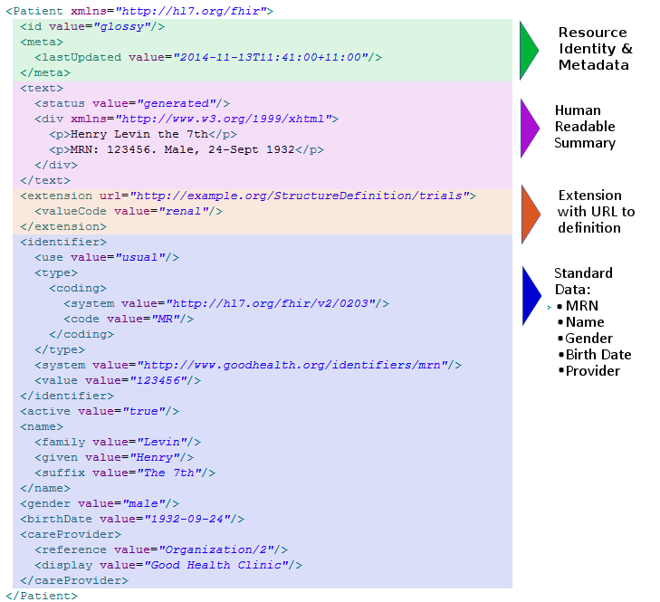

<h4 align="center">Hello, my name is Vadzim Kavalkou and this is my tech blog. You can find here some examples and researches related to software development.</h1>
<h6 align="center">I'm a T-shaped person with core knowledge in the JVM stack area. 
  Proven practical experience with development with <a href="https://www.java.com/en/">Java 6-17</a>, <a href="https://kotlinlang.org/">Kotlin</a>, <a href="https://spring.io/projects/spring-boot">Spring Boot</a>, <a href="https://github.com/GoogleContainerTools/jib">JIB</a>, <a href="https://www.docker.com/">Docker</a>, <a href="https://www.openapis.org/">Open API</a>, <a href="https://gradle.org/">Gradle</a>, <a href="https://www.postgresql.org/">Postgres</a>, <a href="https://flywaydb.org/">Flyway</a>, <a href="https://www.liquibase.org/">Liquibase</a>. 
Familiar with <a href="https://reactjs.org/">ReactJS</a>, <a href="https://vuejs.org/">VueJS</a>, <a href="https://flutter.dev/">Flutter</a>, <a href="https://kubernetes.io/docs/concepts/overview/what-is-kubernetes/">Kubernetes</a>, <a href="https://github.com/features/actions">GitHub Actions</a>/<a href="https://docs.gitlab.com/ee/ci/">Gitlab CI</a>, <a href="https://jmeter.apache.org/">JMeter</a> performance testing, <a href="https://cloud.google.com/gcp/?utm_source=google&utm_medium=cpc&utm_campaign=emea-emea-all-en-dr-bkws-all-all-trial-e-gcp-1010042&utm_content=text-ad-LE-any-DEV_c-CRE_502045654264-ADGP_Hybrid%20%7C%20BKWS%20-%20EXA%20%7C%20Txt%20~%20GCP%20~%20General%23v57-KWID_43700061596202457-kwd-6458750523-userloc_9062748&utm_term=KW_google%20cloud-NET_g-PLAC_&gclid=CjwKCAjwn6GGBhADEiwAruUcKgoRPVFjr_qpwinKXp5sXEZpaFTpAQpP1iPfH9yfmvQGrEji8807BBoCc4kQAvD_BwE&gclsrc=aw.ds">Google Cloud Development</a>, and Architecting.
</h3>

<h2>1. 'Hapi Fhir Dataset Performance Research' using hapi-jpaserver-starter</h4>
<h6>CHAPTER 1: HEY, NICE MARMOT.</h6>
Firstly, I would like to bring you some brief information about the HAPI FHIR.

<a href="https://hapifhir.io/">HAPI FHIR</a> is a complete implementation of the <a href="http://hl7.org/fhir/">HL7 FHIR</a> standard for healthcare interoperability in Java. 
They are an open community developing software licensed under the business-friendly Apache Software License 2.0. 
HAPI FHIR is a product of Smile CDR.

What is <a href="http://hl7.org/fhir/">HL7 FHIR</a>?

FHIR – Fast Healthcare Interoperability Resources – is a next generation standards framework created by HL7. FHIR combines the best features of HL7's v2 , HL7 v3  and CDA  product lines while leveraging the latest web standards and applying a tight focus on implementability.

FHIR solutions are built from a set of modular components called "Resources". These resources can easily be assembled into working systems that solve real world clinical and administrative problems at a fraction of the price of existing alternatives. FHIR is suitable for use in a wide variety of contexts – mobile phone apps, cloud communications, EHR-based data sharing, server communication in large institutional healthcare providers, and much more.

Resource example (it could be illustrated and stored as JSON as well)

<h6>CHAPTER 2: THE HAPI-FHIR-JPASERVER-STARTER ABIDES.</h6>

The HAPI FHIR team provides a set of [open source](https://github.com/hapifhir) solutions for HL7 FHIR.
One of them is [hapi-fhir-jpaserver-starter](https://github.com/hapifhir/hapi-fhir-jpaserver-starter).

To be honest, the HL7 and HAPI FHIR is not the easiest architecture and solution to understand.
You will need some patience, concentration, and time to feel strong in the healthcare domain. 

So, what is the _hapi-fhir-jpaserver-starter_ (HFJS in future)?

This project is a complete starter project you can use to deploy a FHIR server using HAPI FHIR JPA.
This is a typical solution based on [Spring Boot](https://spring.io/projects/spring-boot).

It has one great killer feature: during the start of the application all the schemas and database structures are created as it should be done for HL7.
You can bring your custom changes easily using autoconfiguration, tune your database settings, such as indexes, resource validations both for requests and responses, types of supported resources.

To check up on what you can bring useful in your project, please visit the [demo server](http://hapi.fhir.org/baseR4/swagger-ui/).
It's absolutely not necessary to use all the resources, you can move to microservice architecture and split logic for different domain-based areas.

But as we all know, every cloud has a silver lining.
And this lining is the resource consumption and performance.

<h6>CHAPTER 3: WHERE'S MY PERFORMANCE, LEBOWSKI?</h6>
