------------------------------------------------------------------------------------------------------------------------

_Please be asure that you are familiar with [license](https://www.gnu.org/licenses/agpl-3.0.en.html)._

------------------------------------------------------------------------------------------------------------------------

<h6>CHAPTER 1: HEY, NICE MARMOT.</h6> 
Firstly, I would like to bring you some brief information about the HAPI FHIR.

<a href="https://hapifhir.io/">HAPI FHIR</a> is a complete implementation of the <a href="http://hl7.org/fhir/">HL7 FHIR</a> standard for healthcare interoperability in Java.
They are an open community developing software licensed under the business-friendly Apache Software License 2.0.
HAPI FHIR is a product of Smile CDR.

What is <a href="http://hl7.org/fhir/">HL7 FHIR</a>?

FHIR – Fast Healthcare Interoperability Resources – is a next generation standards framework created by HL7. FHIR combines the best features of HL7's v2 , HL7 v3  and CDA  product lines while leveraging the latest web standards and applying a tight focus on implementability.

FHIR solutions are built from a set of modular components called "Resources". These resources can easily be assembled into working systems that solve real world clinical and administrative problems at a fraction of the price of existing alternatives. FHIR is suitable for use in a wide variety of contexts – mobile phone apps, cloud communications, EHR-based data sharing, server communication in large institutional healthcare providers, and much more.

Resource example (it could be illustrated and stored as JSON as well)


------------------------------------------------------------------------------------------------------------------------

<h6>CHAPTER 2: THE HAPI-FHIR-JPASERVER-STARTER ABIDES.</h6>

The HAPI FHIR team provides a set of [open source](https://github.com/hapifhir) solutions for HL7 FHIR.
One of them is [hapi-fhir-jpaserver-starter](https://github.com/hapifhir/hapi-fhir-jpaserver-starter).

To be honest, the HL7 and HAPI FHIR is not the easiest architecture and solution to understand.
You will need some patience, concentration, and time to feel strong in the healthcare domain.

So, what is the _hapi-fhir-jpaserver-starter_ (HFJS in future)?

This project is a complete starter project you can use to deploy a FHIR server using HAPI FHIR JPA.
This is a typical solution based on [Spring Boot](https://spring.io/projects/spring-boot).

It has one great killer feature: during the start of the application all the schemas and database structures are created as it should be done for HL7.
You can bring your custom changes easily using autoconfiguration, tune your database settings, such as indexes, resource validations both for requests and responses, types of supported resources.

To check up on what you can bring useful in your project, please visit the [demo server](http://hapi.fhir.org/baseR4/swagger-ui/).
It's absolutely not necessary to use all the resources, you can move to microservice architecture and split logic for different domain-based areas.

This project is a fully contained FHIR server, supporting all standard operations (read/create/delete/etc).
It bundles an embedded instance of the H2 Java Database so that the server can run without depending on any external database, but it can also be configured to use an installation of Oracle, Postgres, etc.

Long story short, this is the representation of [HAPI JPA Server architecture](https://hapifhir.io/hapi-fhir/docs/server_jpa/architecture.html):


To dive deeper in the topic, you can follow the next links:
- [Database Schema](https://hapifhir.io/hapi-fhir/docs/server_jpa/schema.html)
- [Configuration](https://hapifhir.io/hapi-fhir/docs/server_jpa/configuration.html)

In spite of all the benefits that HFJS brings to us, there are a lot of trade-offs.
And in a world where every millisecond may costs you a huge profit, the performance, boot-up time, and resources consumption have a great impact.

------------------------------------------------------------------------------------------------------------------------
<h6>CHAPTER 3: IT REALLY TIED THE ROOM TOGETHER.</h6>
After a few months of investigations and data preparations for HFJS, we get the vision of possible resources consumption.
So, we stopped on the next setup, in my honest opinion, this is the minimum requirement for HAPI FHIR.
`OS Linux (amd64) OS ImageOracle Linux Server 8.2 Cores 4, RAM 16000Mi`. 

For compile and build processes we are using `JDK 11, Gradle 7.2.` We've took a useful for us parts of HFJSS, such as `ca.uhn.hapi.fhir:hapi-fhir-base, ca.uhn.hapi.fhir:hapi-fhir-jpaserver-base, ca.uhn.hapi.fhir:hapi-fhir-validation, ca.uhn.hapi.fhir:hapi-fhir-structures-r4, ca.uhn.hapi.fhir:hapi-fhir-validation-resources-r4`.
And we build our own theme park, with blackjack and hO_okers.

The basic configuration for HFJSS had been tuned a bit, mostly tuning affected pools and workers, some searching, validation, and reindexing settings.
If you are not a lot familiar with hikari pool tuning, there is a [great article](https://github.com/brettwooldridge/HikariCP/wiki/About-Pool-Sizing) about pool sizing. Long story short,
The `application.yaml` file with basic settings that could be useful for you has the next structure:

``` yaml
server:
  port: 8080
  shutdown: graceful
  tomcat:
    connection-timeout: 20s
    threads:
      max: 24
      min-spare: 8
  error:
    whitelabel:
      enabled: false

spring:
  application:
    name: hapi-fhir-service
  datasource:
    url: ${DB_URL}
    username: ${DB_USER}
    password: ${DB_PASSWORD}
    driverClassName: org.postgresql.Driver
    hikari:
      minimumIdle: 8
      maximumPoolSize: 32
      connection-timeout: 35000
      pool-name: "hfs-hikari-pool"
      idle-timeout: 10000
      max-lifetime: 30000
      auto-commit: true
  data:
    jpa:
      repositories:
        bootstrap-mode: deferred
  jpa:
    open-in-view: false
    properties:
      hibernate:
        dialect: org.hibernate.dialect.PostgreSQLDialect
        format_sql: false
        show_sql: false
        hbm2ddl.auto: update
        cache:
          use_query_cache: false
          use_second_level_cache: false
          use_structured_entries: false
          use_minimal_puts: false
        search:
          enabled: false
          backend:
            type: lucene
            analysis:
              configurer: ca.uhn.fhir.jpa.search.HapiLuceneAnalysisConfigurer
            directory:
              type: local-filesystem
              root: target/lucenefiles
            lucene_version: lucene_current
  batch:
    job:
      enabled: false
  zipkin:
    sender:
      type: KAFKA
  kafka:
    bootstrap-servers: ${KAFKA_BOOTSTRAP_SERVERS}
  thymeleaf:
    enabled: false

hapi:
  fhir:
    base_path: "/*"
    defer_indexing_for_codesystems_of_size: 101
    supported_resource_types:
      - Patient
      - Observation
      - Organization
      - Encounter
      - Condition
      - Composition
      - EpisodeOfCare
      - Medication
      - MedicationAdministration
      - MedicationRequest
      - Immunization
      - DiagnosticReport
      - Procedure
      - Bundle
      - Goal
      - CarePlan
      - Practitioner
      - Claim
      - ExplanationOfBenefit
      - ValueSet
      - CodeSystem
      - StructureDefinition
      - ImagingStudy
      - List
    allow_external_references: true
    client_id_strategy: ANY
    allow_cascading_deletes: false
    allow_contains_searches: false
    allow_multiple_delete: false
    delete_enable: false
    allow_override_default_search_params: false
    allow_placeholder_references: true
    auto_create_placeholder_reference_targets: true
    default_encoding: JSON
    default_pretty_print: true
    default_page_size: 20
    empi_enabled: false
    enable_index_missing_fields: true
    enforce_referential_integrity_on_delete: true
    enforce_referential_integrity_on_write: true
    etag_support_enabled: true
    expunge_enabled: false
    fhir_version: R4
    fhir_path_interceptor_enabled: false
    filter_search_enabled: true
    graphql_enabled: false
    binary_storage_enabled: false
    last-n-enabled: false
    mark-resources-for-reindexing-upon-search-parameter-change: false
    max_binary_size: 104857600
    max_page_size: 200
    bulk_export_enabled: false
    retain_cached_searches_mins: 60
    reuse_cached_search_results_millis: 60000
    partitioning:
      enabled: false
      cross_partition_reference_mode: true
      multitenancy_enabled: true
      partitioning_include_in_search_hashes: true
    persistenceUnitName: "HAPI_PERSISTENCE_UNIT"
    cors:
      enabled: false
      allow_credentials: true
      allowed_origin:
        - '*'
    expunge-thread-count: 2
    reindex-thread-count: 2
    search-total-mode: ESTIMATED
    search-coord-core-pool-size: 20
    search-coord-max-pool-size: 100
    search-coord-queue-capacity: 20
    status-based-reindexing-disabled: true
    normalized_quantity_search_level: NORMALIZED_QUANTITY_SEARCH_SUPPORTED
    enable_index_contained_resource: false
    validation:
      enabled: true
      requests_enabled: true
      responses_enabled: false
    logger:
      enabled: true
      name: "fhirtest.access"
      error_format: "[HAPI FHIR ERROR] - ${requestVerb} ${requestUrl}"
      format: "Path[${servletPath}] Source[${requestHeader.x-forwarded-for}] Operation[${operationType} ${operationName} ${idOrResourceName}] UA[${requestHeader.user-agent}] Params[${requestParameters}] ResponseEncoding[${responseEncodingNoDefault}] Operation[${operationType} ${operationName} ${idOrResourceName}] UA[${requestHeader.user-agent}] Params[${requestParameters}] ResponseEncoding[${responseEncodingNoDefault}]"
      log_exceptions: true
    elasticsearch:
      enabled: false

```

One important thing is that we disabled hibernate caching to get clear performance metrics of the server as it is.

The average time to boot up the service depends on if it's the first start because the database structure could be created or not.
For sure, on production, we will use warm-up, and mostly we will have the situation without creating a database structure.
We will cover this and other topics in next chapters.

To my mind, I ought to share with you some use cases that we will cover with performance tests. You can find that most of all there are READ operations, and that is correct.
The user will do these operations most of all, and we should follow his/her behavior.

Outpatient practice (ambulatory):

| #  | Scenario step          | Assumed FHIR data operation |
| :---------------------: | :--------------------- | :-------------------------- |
| 1 | Login              |             |
| 2 | As a doctor, I want to open my patient’s medical card with general information page with diagnoses | Get  Patient resource, get several (10) Condition resources for this patient |
| 3 | As a doctor, I want to look through titles and dates of all available to me medical records (sections) for my patient for all the time | |
| 4 | As a doctor, I want to open some of them and read (e.g. General blood analysis 12.09.2003, Renal ultrasound 18.02.2014, General blood analysis 22.06.2020). Alternative flow: As a doctor, I want to scroll and look through all sections in my patient's card | Simultaneously get 10 DiagnosticReports by IDs, including all references recursively (_include:recurse=*) |
| 5 | As a doctor, I want to create a new medical record (section) of today’s visit and save it | Create DiagnosticReport with subject = this patient and 10 Observations in a result array |
| 6 | As a doctor, I want to close current patient and see a list of patients again as described in (2) | See (2) |
| 7 | Repeat (2) - (7) every 15-30 minutes for each patient | |
| 8 | Logout |  |

Inpatient practice (hospital):

| #  | Scenario step          | Assumed FHIR data operation |
| :---------------------: | :--------------------- | :-------------------------- |
| 1 | Login              |             |
| 2 | As a doctor, I want to see my list of patients, that are in my responsibility today: patients that are now in my hospital in my department and assigned to me | Find all Patients, that have EpisodeOfCare with period including [some date] AND [some] managingOrganization |
| 3 | As a doctor, I want to open my patient’s medical card with general information page | Get Patient resource, get several (5-20) resources for this patient, like AllergyIntolerance, Condition, RelatedPerson, Immunization |
| 4 | As a doctor, I want to look through titles and dates of all available to me medical records (sections) for my patient for all the time | Select all Compositions with subject = this patient (in average, 50, can be 5-200) |
| 5 | As a doctor, I want to open some of them and read (e.g. General blood analysis 12.09.2003, Renal ultrasound 18.02.2014, General blood analysis 22.12.2021) | For each of 3 opened medical records: Get Composition, in it’s section for all entryes select DiagnosticReport, in it’s result for all references select all (1-25) Observations |
| 6 | As a doctor, I want to look through dates and diagnoses of all hospitalizations of my patient | Find all EpisodeOfCare that was for this Patient |
| 7 | As a doctor, I want to open some hospitalizations (medical forms) and read all sections in them (e.g. Acute appendicitis 21.04.2017-25.04.2017, Pneumonia 13.09.2019-28.09.2019) | For each hospitalization (EpisodeOfCare) – find  Composition that in event in detail contains a reference to current EpisodeOfCare. For that Composition for all sections (5-20) in it’s entryes select all (1-25) Observations |
| 8 | As a doctor, I want to open a medical form for current hospitalization and read all sections | The same as (7) |
| 9 | As a doctor, I want to create a new section in this medical form with a daily medical record of my examination | Create Composition with subject = this patient and 10-30 Observations as entryes in it’s section |
| 10 | As a doctor, I want to close current patient and see a list of patients again as described in (2) | See (2) |
| 11 | Repeat (2) - (7) every 15-30 minutes for each patient |  |
| 12 | Logout |  |

------------------------------------------------------------------------------------------------------------------------
<h6>CHAPTER 4: WHERE'S MY RESOURCES, LEBOWSKI?</h6>

Moreover, it would be nice to provide you with some information regarding the datasets we've used.
The `Resources` we've used are the next (all the multipliers for resources that related to `Patient` were gained from researching the institutions and organization):

| Resource          | Multiplier | 1 step   | 2 step     | 3 step     | 4 step     | 5 step      |
| :---------------- | :----------| :--------| :--------  | :--------  | :--------  | :--------   |
| Patient           | x1         | 50_000   | 100_000    | 250_000    | 500_000    | 1_000_000   |
| Observation       | x100       | 5_000_000| 10_000_000 | 25_000_000 | 50_000_000 | 100_000_000 |
| Diagnostic Report | x10        | 500_000  | 1_000_000  | 2_500_000  | 5_000_000  | 10_000_000  |
| Condition         | x10        | 500_000  | 1_000_000  | 2_500_000  | 5_000_000  | 10_000_000  |
| Procedure         | x3         | 150_000  | 300_000    | 750_000    | 1_500_000  | 3_000_000   |
| Episode Of Care   | x2         | 100_000  | 200_000    | 500_000    | 1_000_000  | 2_000_000   |
| Composition       | x2         | 100_000  | 200_000    | 500_000    | 1_000_000  | 2_000_000   |
| DB dump size (GiB)| `N/A`      | 6,5      | 15         | 43         | 100        | 230         |

------------------------------------------------------------------------------------------------------------------------

<h6>CHAPTER 5: WHERE'S MY PERFORMANCE, LEBOWSKI?</h6>

At the very beginning of this chapter, I would like to share with you some special secrets.
The hapi fhir server is a healthcare one and the business is not going to deal with a huge RPS.
But the metrics that I will share with you soon could help us to understand the possible scaling strategy better, follow fault-tolerance best practices, and provide the vision of resources consumption.
The last but not least, all these metrics can help us to predict some cost management.

Let's assume that the average institution has the biggest load from 8:00 till 17:00.
As a result, we will have ~40 business hours per week. The next metrics will be presented for a typical business day (transactions per working day, TPWD in future) and RPS as well.
And now, show me the numbers, dude!

Please, take a look at abbreviations I will use in the next tables:

- TPS - TRANSACTIONS PER SECOND
- RTOT - RESPONSE TIMES OVER TIME
- HPS - HITS PER SECOND
- ATOT - ACTIVE THREADS OVER TIME

<h2>Tomcat</h6>

- G1

| Step | TPWD  |TPS | RTOT |HPS  |ATOT | NODE| JVM  | HIKARI       | POSTGRES |
| :--- | :-----|:---| :----|:----|:----|:----| :----| :------------|:---------|
| 1    | 460800|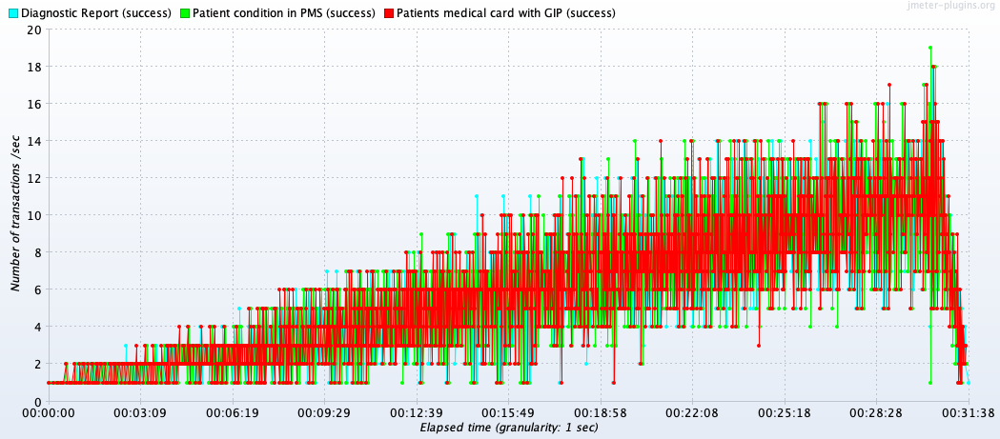 |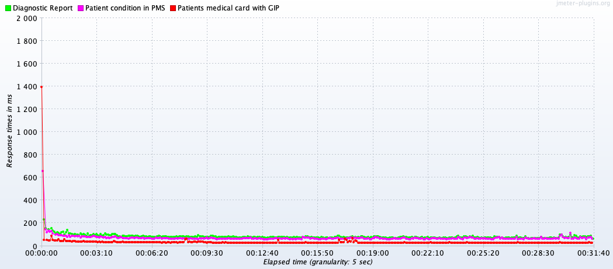|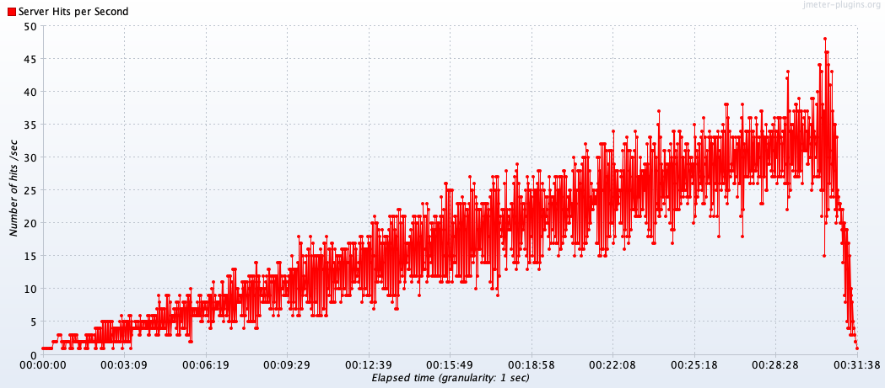||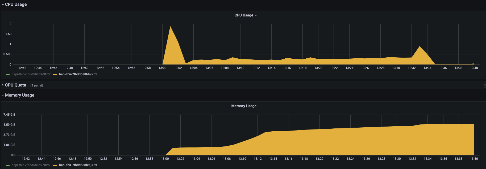|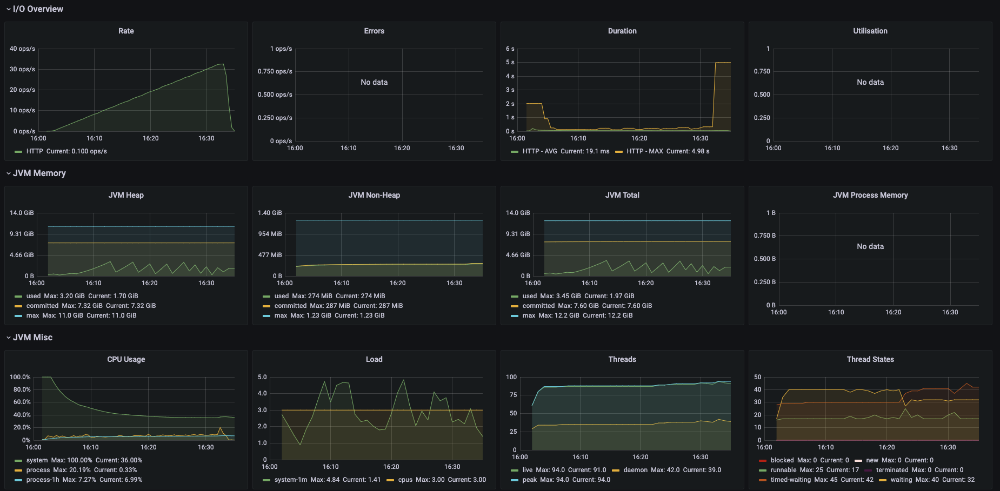|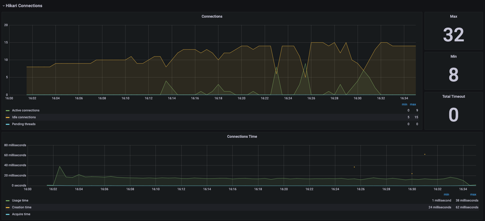|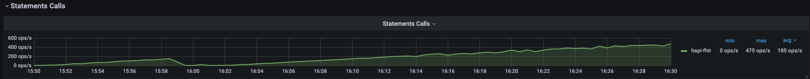 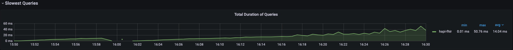|
| 2    | TBD| ||||||| |
| 3    | TDB| ||||||| |
| 4    | TBD| ||||||| |
| 5    | TBD| ||||||| |

- ZGC

| Step | TPWD  |TPS | RTOT |HPS  |ATOT | NODE| JVM  | HIKARI       | POSTGRES |
| :--- | :-----|:---| :----|:----|:----|:----| :----| :------------|:---------|
| 1    | TBD| ||||||| |
| 2    | TBD| ||||||| |
| 3    | TDB| ||||||| |
| 4    | TBD| ||||||| |
| 5    | TBD| ||||||| |

- SHENANDOAH GC

| Step | TPWD  |TPS | RTOT |HPS  |ATOT | NODE| JVM  | HIKARI       | POSTGRES |
| :--- | :-----|:---| :----|:----|:----|:----| :----| :------------|:---------|
| 1    | TBD| ||||||| |
| 2    | TBD| ||||||| |
| 3    | TDB| ||||||| |
| 4    | TBD| ||||||| |
| 5    | TBD| ||||||| |

<h2>Jetty</h6>

- G1

| Step | TPWD  |TPS | RTOT |HPS  |ATOT | NODE| JVM  | HIKARI       | POSTGRES |
| :--- | :-----|:---| :----|:----|:----|:----| :----| :------------|:---------|
| 1    | TBD|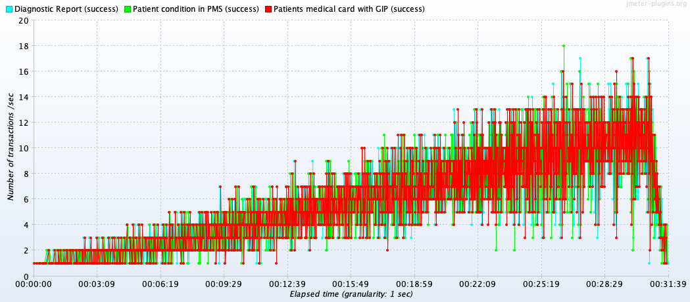 |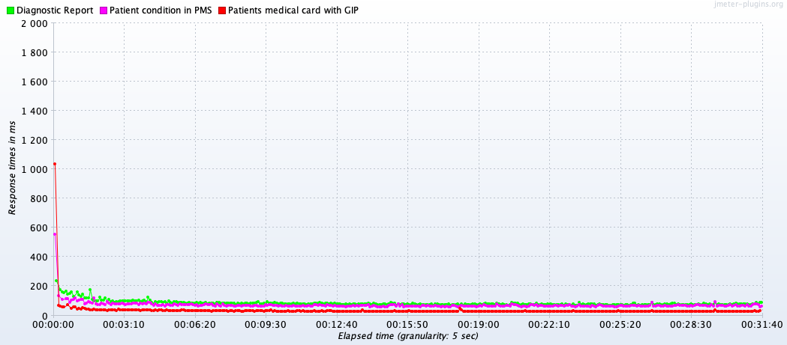|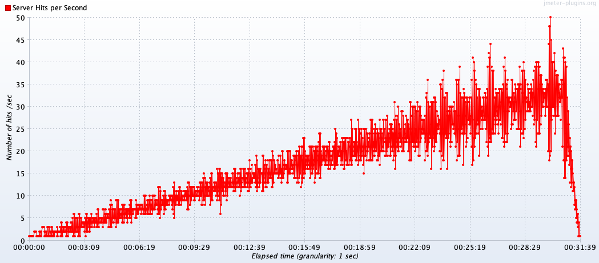|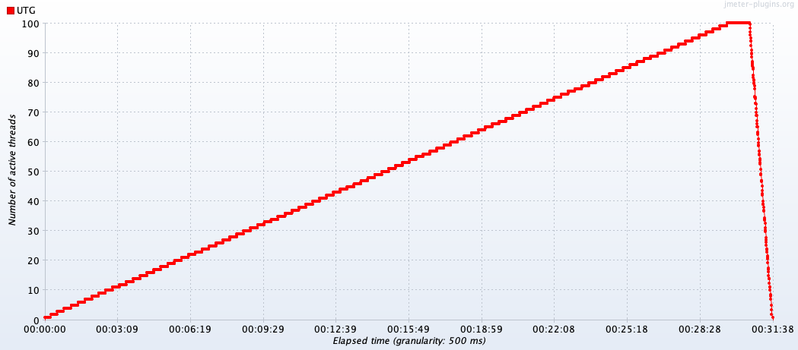||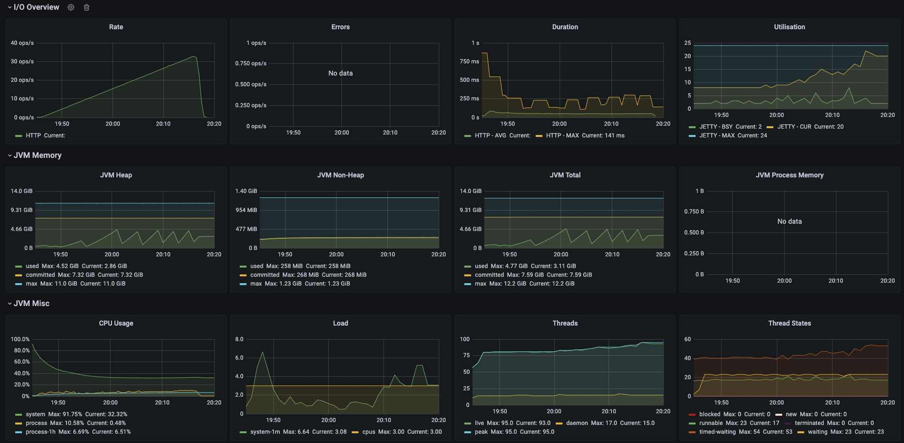|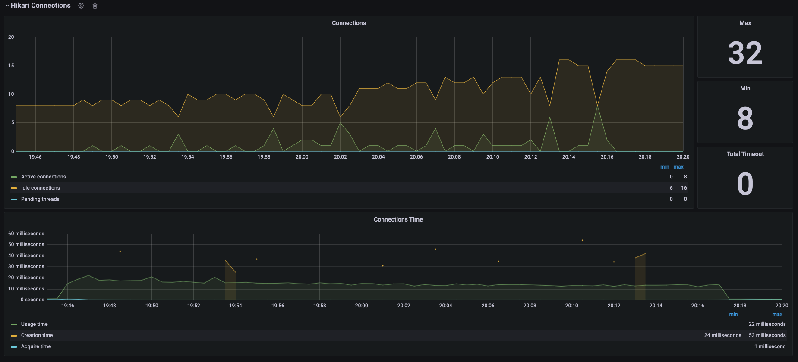|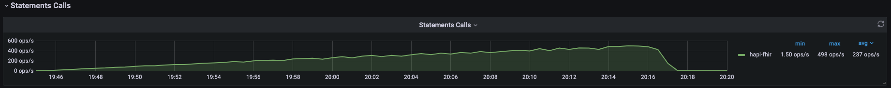 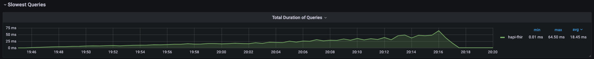|
| 2    | TBD| ||||||| |
| 3    | TDB| ||||||| |
| 4    | TBD| ||||||| |
| 5    | TBD| ||||||| |

- ZGC

| Step | TPWD  |TPS | RTOT |HPS  |ATOT | NODE| JVM  | HIKARI       | POSTGRES |
| :--- | :-----|:---| :----|:----|:----|:----| :----| :------------|:---------|
| 1    | TBD| ||||||| |
| 2    | TBD| ||||||| |
| 3    | TDB| ||||||| |
| 4    | TBD| ||||||| |
| 5    | TBD| ||||||| |

- SHENANDOAH GC

| Step | TPWD  |TPS | RTOT |HPS  |ATOT | NODE| JVM  | HIKARI       | POSTGRES |
| :--- | :-----|:---| :----|:----|:----|:----| :----| :------------|:---------|
| 1    | TBD| ||||||| |
| 2    | TBD| ||||||| |
| 3    | TDB| ||||||| |
| 4    | TBD| ||||||| |
| 5    | TBD| ||||||| |

<h2>Undertow</h6>

- G1

| Step | TPWD  |TPS | RTOT |HPS  |ATOT | NODE| JVM  | HIKARI       | POSTGRES |
| :--- | :-----|:---| :----|:----|:----|:----| :----| :------------|:---------|
| 1    | TBD|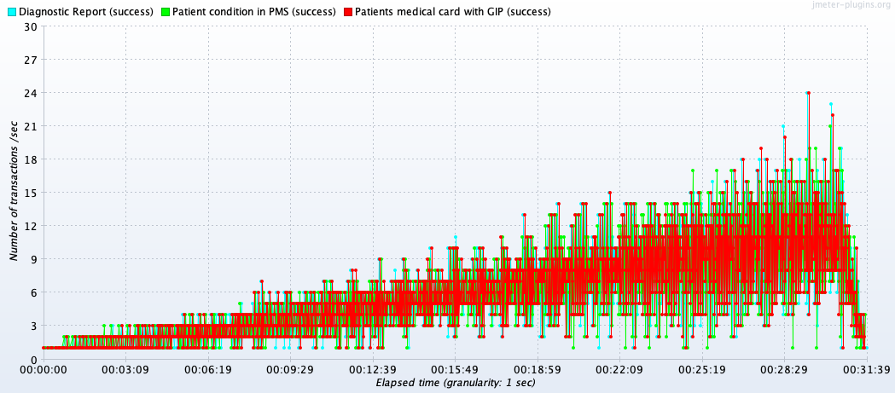 |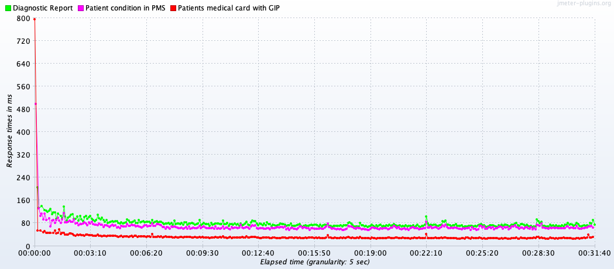|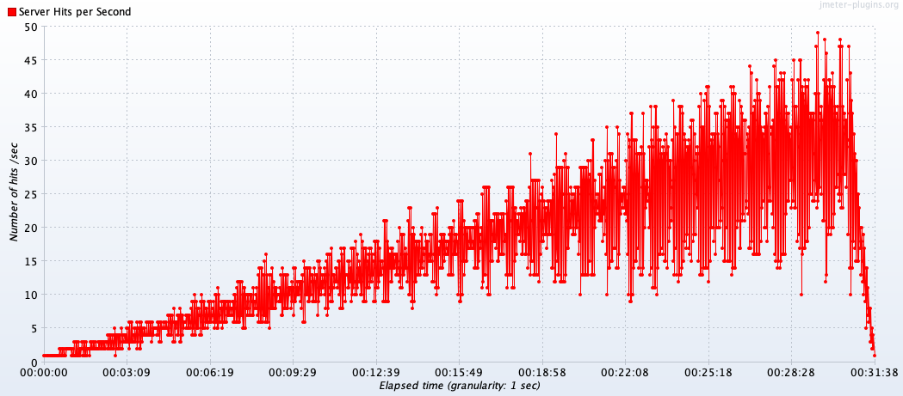||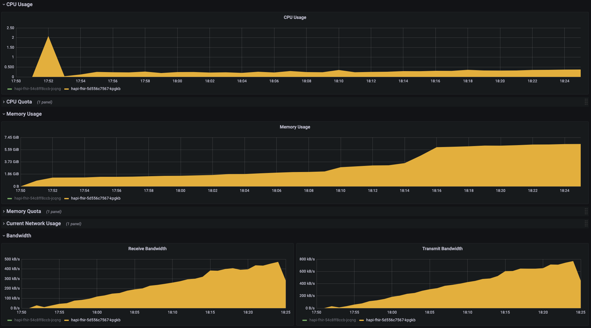|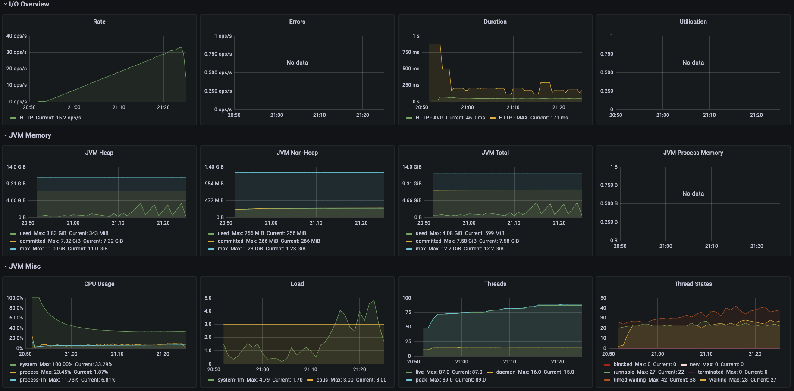|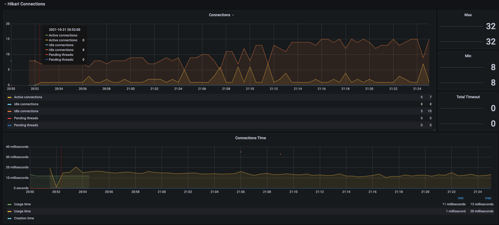|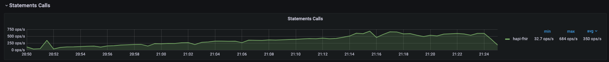 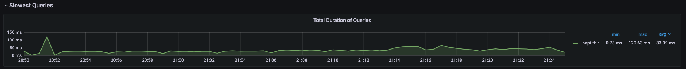|
| 2    | TBD| ||||||| |
| 3    | TDB| ||||||| |
| 4    | TBD| ||||||| |
| 5    | TBD| ||||||| |

- ZGC

| Step | TPWD  |TPS | RTOT |HPS  |ATOT | NODE| JVM  | HIKARI       | POSTGRES |
| :--- | :-----|:---| :----|:----|:----|:----| :----| :------------|:---------|
| 1    | TBD| ||||||| |
| 2    | TBD| ||||||| |
| 3    | TDB| ||||||| |
| 4    | TBD| ||||||| |
| 5    | TBD| ||||||| |

- SHENANDOAH GC

| Step | TPWD  |TPS | RTOT |HPS  |ATOT | NODE| JVM  | HIKARI       | POSTGRES |
| :--- | :-----|:---| :----|:----|:----|:----| :----| :------------|:---------|
| 1    | TBD| ||||||| |
| 2    | TBD| ||||||| |
| 3    | TDB| ||||||| |
| 4    | TBD| ||||||| |
| 5    | TBD| ||||||| |

------------------------------------------------------------------------------------------------------------------------

<h6>CHAPTER 6: WHERE'S MY BOOT-UP TIME, LEBOWSKI?</h6>

All the steps that we can find in the table below were described in chapter 4.
Now we will take a look at boot-up metrics on different embedded web servers.

Due to the fact, that we are using fewer libraries than the default HFJS starter it decreases the boot time up to 2 times.

| Step | Tomcat   | Jetty    | Undertow |
| :---:| :------: | :------: | :------: | 
| 1    | ~ 80s    |          |          |
| 2    |          |          |          |
| 3    |          |          |          |
| 4    |          |          |          |
| 5    |          |          |          |

Moreover, to decrease the boot-up time we added [spring-indexer](https://docs.spring.io/spring-framework/docs/current/reference/html/core.html#beans-scanning-index).
While classpath scanning is very fast, it is possible to improve the startup performance of large applications by creating a static list of candidates at compilation time.
In this mode, all modules that are targets of component scanning must use this mechanism.
It creates `META-INF/spring.components` were all the beans described.

Actually, it increases the build time in few seconds, but every cloud has a silver lining.

------------------------------------------------------------------------------------------------------------------------

<h6>CHAPTER 7: I CAN'T BE WORRYING ABOUT THAT SH1T. LIFE GOES ON, MAN.</h6>

------------------------------------------------------------------------------------------------------------------------

<h6>BONUS: HA HEY, THIS IS A PRIVATE RESIDENCE MAN.</h6>

- [ ] JDK 11 vs JDK 17

| Step | GC           | TPWD  |TPS | RTOT |HPS  |ATOT | NODE| JVM  | HIKARI       | POSTGRES |
| :--- |:-------------| :-----|:---| :----|:----|:----|:----| :----| :------------|:---------|
| 5    | G1           | TBD| ||||||| |
| 5    | ZGC          | TBD| ||||||| |
| 5    | SHENANDOAH   | TBD| ||||||| |

- [ ] Compare JDK 11 and JDK 17
- [ ] Migrate to POSTGRES 14

  The final fight is migration from Postgres 13.3 to [Postgres 14.0](https://www.postgresql.org/docs/release/14.0/) due to having a lot of performance tunings, such as:
- Numerous performance improvements have been made for parallel queries, heavily-concurrent workloads, partitioned tables, logical replication, and vacuuming;
- B-tree index updates are managed more efficiently, reducing index bloat;
- VACUUM automatically becomes more aggressive, and skips inessential cleanup, if the database starts to approach a transaction ID wraparound condition.

| Step | GC           | TPWD  |TPS | RTOT |HPS  |ATOT | NODE| JVM  | HIKARI       | POSTGRES |
| :--- |:-------------| :-----|:---| :----|:----|:----|:----| :----| :------------|:---------|
| 5    | TBD          | TBD| ||||||| |

- [ ] Compare POSTGRES 13 and POSTGRES 14

- [ ] Try to build it with GraalVM

| Step | GC           | TPWD  |TPS | RTOT |HPS  |ATOT | NODE| JVM  | HIKARI       | POSTGRES |
| :--- |:-------------| :-----|:---| :----|:----|:----|:----| :----| :------------|:---------|
| 5    |              | TBD   | ||||||| |

- [ ] Compare JDK best choice and GRAALVM

- [ ] Most comfortable setup for application

Thank you.

If you have any question, feel free to contact me direct in linkedin or via email.

Have a nice day, dude!

------------------------------------------------------------------------------------------------------------------------

[BACK TO THE MAIN PAGE](../README.md)
