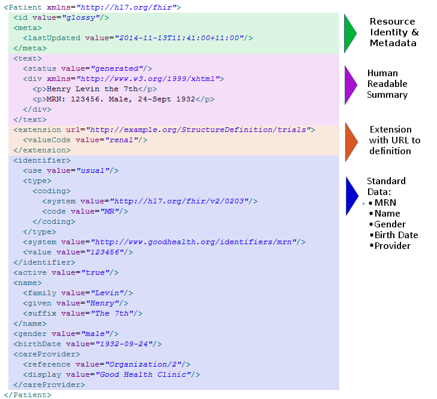
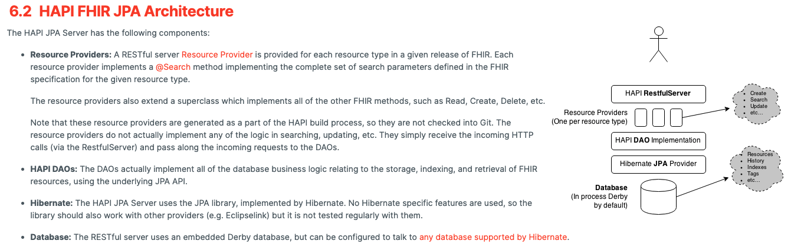

<h6>CHAPTER 1: HEY, NICE MARMOT.</h6> 
Firstly, I would like to bring you some brief information about the HAPI FHIR.

<a href="https://hapifhir.io/">HAPI FHIR</a> is a complete implementation of the <a href="http://hl7.org/fhir/">HL7 FHIR</a> standard for healthcare interoperability in Java.
They are an open community developing software licensed under the business-friendly Apache Software License 2.0.
HAPI FHIR is a product of Smile CDR.

What is <a href="http://hl7.org/fhir/">HL7 FHIR</a>?

FHIR – Fast Healthcare Interoperability Resources – is a next generation standards framework created by HL7. FHIR combines the best features of HL7's v2 , HL7 v3  and CDA  product lines while leveraging the latest web standards and applying a tight focus on implementability.

FHIR solutions are built from a set of modular components called "Resources". These resources can easily be assembled into working systems that solve real world clinical and administrative problems at a fraction of the price of existing alternatives. FHIR is suitable for use in a wide variety of contexts – mobile phone apps, cloud communications, EHR-based data sharing, server communication in large institutional healthcare providers, and much more.

Resource example (it could be illustrated and stored as JSON as well)

<h6>CHAPTER 2: THE HAPI-FHIR-JPASERVER-STARTER ABIDES.</h6>

The HAPI FHIR team provides a set of [open source](https://github.com/hapifhir) solutions for HL7 FHIR.
One of them is [hapi-fhir-jpaserver-starter](https://github.com/hapifhir/hapi-fhir-jpaserver-starter).

To be honest, the HL7 and HAPI FHIR is not the easiest architecture and solution to understand.
You will need some patience, concentration, and time to feel strong in the healthcare domain.

So, what is the _hapi-fhir-jpaserver-starter_ (HFJS in future)?

This project is a complete starter project you can use to deploy a FHIR server using HAPI FHIR JPA.
This is a typical solution based on [Spring Boot](https://spring.io/projects/spring-boot).

It has one great killer feature: during the start of the application all the schemas and database structures are created as it should be done for HL7.
You can bring your custom changes easily using autoconfiguration, tune your database settings, such as indexes, resource validations both for requests and responses, types of supported resources.

To check up on what you can bring useful in your project, please visit the [demo server](http://hapi.fhir.org/baseR4/swagger-ui/).
It's absolutely not necessary to use all the resources, you can move to microservice architecture and split logic for different domain-based areas.

This project is a fully contained FHIR server, supporting all standard operations (read/create/delete/etc).
It bundles an embedded instance of the H2 Java Database so that the server can run without depending on any external database, but it can also be configured to use an installation of Oracle, Postgres, etc.

Long story short, this is the representation of [HAPI JPA Server architecture](https://hapifhir.io/hapi-fhir/docs/server_jpa/architecture.html):

To dive deeper in the topic, you can follow the next links:
- [Database Schema](https://hapifhir.io/hapi-fhir/docs/server_jpa/schema.html)
- [Configuration](https://hapifhir.io/hapi-fhir/docs/server_jpa/configuration.html)

In spite of all the benefits that HFJS brings to us, there are a lot of trade-offs.
And in a world where every millisecond may costs you a huge profit, the performance, boot-up time, and resources consumption have a great impact.

<h6>CHAPTER 3: WHERE'S MY RESOURCES, LEBOWSKI?</h6>
<h6>CHAPTER 4: WHERE'S MY PERFORMANCE, LEBOWSKI?</h6>
<h6>CHAPTER 5: WHERE'S MY BOOT-UP TIME, LEBOWSKI?</h6>
<h6>CHAPTER 6: I CAN'T BE WORRYING ABOUT THAT SH1T. LIFE GOES ON, MAN.</h6>

[BACK TO THE MAIN PAGE](../README.md)
