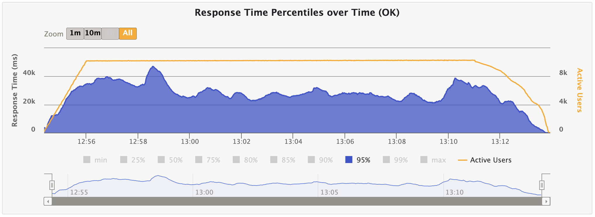
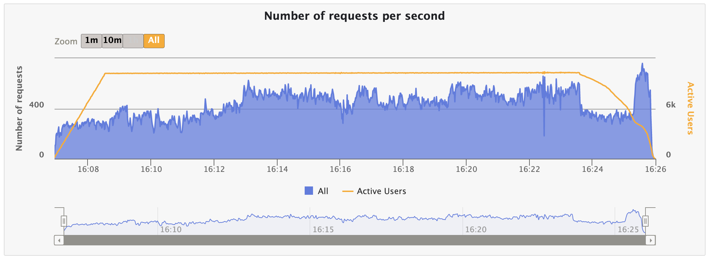
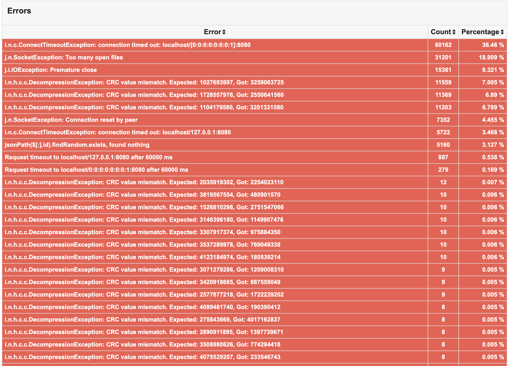

------------------------------------------------------------------------------------------------------------------------


<h6>CHAPTER 1: IF YOU’RE GOOD AT SOMETHING, NEVER DO IT FOR FREE.</h6>

Hello, world,

Today I would like to test [Micronaut](https://micronaut.io/):

>A MODERN, JVM-BASED, FULL-STACK FRAMEWORK FOR BUILDING MODULAR, EASILY TESTABLE MICROSERVICE AND SERVERLESS APPLICATIONS.

Modern... talking? :) Let's check it.

[Micronaut says](https://micronaut.io/2020/04/07/micronaut-vs-quarkus-vs-spring-boot-performance-on-jdk-14/) that it's faster and less expensive due to the fact of lower resources consumption and [better serialization](https://micronaut.io/2022/01/31/micronaut-serialization/) during the build time.

Trust but verify.
So, I am going to verify it.

I will test the most efficient approach of Spring and Quarkus to compare it.
And I would like to test the reactive approach using [reactor-http](https://github.com/micronaut-projects/micronaut-reactor) and [data-r2dbc with r2dc-pool and vertx-pg-client](https://micronaut-projects.github.io/micronaut-r2dbc/1.0.x/guide/) (same to Quarkus, yeah!).

I hope you are familiar with my previous performance results regarding the Spring Web (as Native), and Spring Reactive (as Native), and Quarkus Reactive (as Native).
If not, please take a look on it:

- [Spring Reactive (as Native)](../spring-boot-reactive_vs_spring-boot-reactive-native/SPRING-BOOT-REACTIVE_VS_SPRING-BOOT-REACTIVE-NATIVE.md)
- [Quarkus Reactive (as Native)](../quarkus-reactive_vs_quarkus-reactive-native/QUARKUS-REACTIVE_VS_QUARKUS-REACTIVE-NATIVE.md)

This article is not about Micronaut internal architecture and design, its paradigms, and the solutions that Micronaut Team brings to life.
This article is about performance.

I will not dive deeper into the Micronaut Reactive stack and the business description of my application you could always read it on your own in my previous research and in the documentations.

And today I will check the performance of a native executable (including in the docker solution) and a default one (including inD solution as well).

------------------------------------------------------------------------------------------------------------------------
<h6>CHAPTER 2: WHAT DOESN'T KILL YOU, SIMPLY MAKES YOU STRONGER!</h6>

So, we are going to create our application based on Micronaut.
Hopefully, the developers who are familiar with Spring or Quarkus could easily migrate to Micronaut.
But... I've faced several problems during the migration:
1. Micronaut doesn't support Money type in Postgres. And that's [cool](https://wiki.postgresql.org/wiki/Don%27t_Do_This#Don.27t_use_money);
2. Not so clear documentation as it is for Quarkus and Spring. In some cases it's really poor;
3. To avoid workarounds on the backend part with micronaut data lib, I had to rename several columns i.e. origin -> origin_id;
4. If not to define connections as 'pool' you are working with connection per thread model;
5. [Doesn't support Gradle 8.0.1](https://github.com/micronaut-projects/micronaut-gradle-plugin/issues/649). The team doesn't follow one of the major building tools. Didn't prepare using RC of Gradle.

The languages, frameworks, and tools I used:

|JDK|GC|Gradle|Micronaut|Gatling|Dive  |Grype |
|:--|:-|:-----|:--------|:------|:-----|:-----|
|17 |G1|8.0.1 |3.8.5    |3.9.2  |0.10.0|0.57.1|

My local setup:

|Model      |Processor              |Processor Speed|Number of Processors|Cores|L2 Cache (per Core)|L3 Cache|Memory|
|:----------|:----------------------|:--------------|:-------------------|:----|:------------------|:-------|:-----|
|MacBook Pro|Quad-Core Intel Core i7|2,3 GHz        |1                   |4    |512KB              |8MB     |32GB  |

I will highlight some of the configurations here.

### Gradle Build Script

```groovy

// https://github.com/bmuschko/gradle-docker-plugin/issues/1035
buildscript {
    dependencies {
        classpath("com.github.docker-java:docker-java:3.3.0")
        classpath("com.github.docker-java:docker-java-transport-httpclient5:3.3.0")
    }
}

plugins {
    id("com.github.johnrengelman.shadow") version "7.1.2"
    id("com.google.cloud.tools.jib") version "3.3.1"
    id("io.micronaut.minimal.application") version "3.7.2"
    id("io.micronaut.graalvm") version "3.7.2"
    id("io.micronaut.docker") version "3.7.2"
    id("io.micronaut.aot") version "3.7.2"
    id("java")
}

version = "0.0.1-SNAPSHOT"
group = "by.vk"

application {
    mainClass.set("by.vk.Application")
}

java {
    sourceCompatibility = JavaVersion.toVersion("17")
    targetCompatibility = JavaVersion.toVersion("17")
}

repositories {
    mavenCentral()
}

dependencies {
    annotationProcessor("io.micronaut.data:micronaut-data-processor")
    annotationProcessor("io.micronaut.serde:micronaut-serde-processor")
    implementation("io.micronaut.serde:micronaut-serde-jackson")
    implementation("io.micronaut.data:micronaut-data-r2dbc")
    implementation("io.micronaut.reactor:micronaut-reactor-http-client")
    implementation("jakarta.persistence:jakarta.persistence-api:3.1.0")
    runtimeOnly("ch.qos.logback:logback-classic")
    runtimeOnly("io.vertx:vertx-pg-client")
    runtimeOnly("io.r2dbc:r2dbc-pool")
    runtimeOnly("org.postgresql:r2dbc-postgresql:1.0.1.RELEASE")
}

tasks {
    jib {
        to {
            image = 'micronaut-reactive-distroless:latest'
        }
        from {
            image = "gcr.io/distroless/java17"
        }
        container {
            jvmFlags = ['-noverify', '-XX:+UseContainerSupport', '-XX:MaxRAMPercentage=75.0', '-XX:InitialRAMPercentage=50.0', '-XX:+OptimizeStringConcat', '-XX:+UseStringDeduplication', '-XX:+ExitOnOutOfMemoryError', '-XX:+AlwaysActAsServerClassMachine', '-Xmx512m', '-Xms128m', '-XX:MaxMetaspaceSize=128m', '-XX:MaxDirectMemorySize=256m', '-XX:+HeapDumpOnOutOfMemoryError', '-XX:HeapDumpPath=/opt/tmp/heapdump.bin', '-Djava.rmi.server.hostname=localhost', '-Dcom.sun.management.jmxremote=true', '-Dcom.sun.management.jmxremote.rmi.port=8051','-Dcom.sun.management.jmxremote.port=8051', '-Dcom.sun.management.jmxremote.local.only=false', '-Dcom.sun.management.jmxremote.authenticate=false', '-Dcom.sun.management.jmxremote.ssl=false']
            ports = ['8080', '8051']
            labels.set([maintainer: 'Vadzim Kavalkou <vadzim.kavalkou@gmail.com>', appname: 'a2b-service', version: '0.0.1-SNAPSHOT'])
            creationTime.set('USE_CURRENT_TIMESTAMP')
        }
    }
    dockerfile {
        exposedPorts.set([8080, 8051])
        args = ['-XX:+UseContainerSupport', '-XX:MaxRAMPercentage=75.0', '-XX:InitialRAMPercentage=50.0', '-XX:+OptimizeStringConcat', '-XX:+UseStringDeduplication', '-XX:+ExitOnOutOfMemoryError', '-XX:+AlwaysActAsServerClassMachine', '-Xmx512m', '-Xms128m', '-XX:MaxMetaspaceSize=128m', '-XX:MaxDirectMemorySize=256m', '-XX:+HeapDumpOnOutOfMemoryError', '-XX:HeapDumpPath=/opt/tmp/heapdump.bin', '-Djava.rmi.server.hostname=localhost', '-Dcom.sun.management.jmxremote=true', '-Dcom.sun.management.jmxremote.rmi.port=8051','-Dcom.sun.management.jmxremote.port=8051', '-Dcom.sun.management.jmxremote.local.only=false', '-Dcom.sun.management.jmxremote.authenticate=false', '-Dcom.sun.management.jmxremote.ssl=false']
    }
}

micronaut {
    runtime("netty")
    processing {
        incremental(true)
        annotations("by.vk.*")
    }
    aot {
        cacheEnvironment = true
        optimizeServiceLoading = true
        optimizeClassLoading = true
        convertYamlToJava = true
        precomputeOperations = true
        deduceEnvironment = true
        optimizeNetty = true
    }

}

```

And application.yml, for sure.

```yaml

micronaut:
  application:
    name: micronaut-reactive
  server:
    port: 8080
    context-path: "/api/v1"
    netty:
      responses:
        file:
          cache-seconds: 0

netty:
  default:
    allocator:
      use-cache-for-all-threads: false

# https://micronaut-projects.github.io/micronaut-sql/latest/guide/configurationreference.html
# https://github.com/eclipse-vertx/vert.x/blob/master/src/main/java/io/vertx/core/VertxOptions.java#L38
r2dbc:
  datasources:
    options:
      useDaemonThread: true
      driver: pool
      protocol: postgres
      host: postgres-a2b
      port: 5432
      username: postgres
      password: postgres
      database: a2b
      connectTimeout: 35000ms

```

As I've already mentioned, I decided to check all possible types of launching the application, such as jar, jar in docker, native executable, and in docker native solutions as well.

In Micronaut you have [several ways](https://guides.micronaut.io/latest/micronaut-docker-image-gradle-java.html) of building a docker image:
- JAR in Docker;
- JIB;
- GraalVM native executable in Docker;
- [CRaC](https://openjdk.org/projects/crac/);
- AOT optimized docker image.

I will provide you the link to sources in the end of this article.

And now "Just do it".


------------------------------------------------------------------------------------------------------------------------
<h6>CHAPTER 3: THEY LAUGH AT ME BECAUSE I'M DIFFERENT. I LAUGH AT THEN BECAUSE THEY'RE ALL THE SAME.</h6>

There are results of non-native solutions.

* JAR

Global information:


Requests:


Requests per second:


Responses per second:


Response time for first minute:


Response time for all time:


You could download the [JAR Performance Tests Results](./static/reactive/jar/reactive_jar.zip) and check it on your own.

* JIB with Distroless base image

Global information:


Requests:


Requests per second:


Responses per second:


Response time for first minute:


Response time for all time:



Docker image investigation:

Dive:


Grype:


You could download the [Distroless Performance Tests Results](./static/reactive/jib/distroless/reactive-jib-distroless.zip) and check it on your own.

* Default Docker Image

Global information:


Requests:


Requests per second:



Responses per second:


Response time for first minute:


Response time for all time:


Docker image investigation:

Dive:


Grype:


You could download the [Default Docker Image Performance Tests Results](./static/reactive/docker/default/reactive-docker.zip) and check it on your own.

Let's gather all the information:

|TYPE                |BUILD TIME (s)|ARTIFACT SIZE (MB)|BOOT UP (s)|RPS    |RESPONSE TIME (95th pct) (ms)|SATURATION POINT|RAM (MB)|CPU (%)|THREADS (MAX)|POSTGRES CPU (%)|
|:-------------------|:-------------|:-----------------|:----------|:------|:----------------------------|:---------------|:-------|:------|:------------|:---------------|
|JAR                 |17            |21.4              |1.176      |616.132|19540                        |2487            |4495    |10     |49           |75              |
|DEFAULT DOCKER IMAGE|74            |346               |2.373      |425.895|41730                        |1189            |586     |59     |23           |26              |
|JIB                 |21            |252               |1.767      |416.672|37474                        |1023            |586     |60     |26           |31              |

Move on.

------------------------------------------------------------------------------------------------------------------------

<h6>CHAPTER 4: IF YOU’RE GOOD AT SOMETHING, NEVER DO IT FOR FREE.</h6>

Now it's a time to compare previous solutions with native ones.

* Native Executable

Global information:


Requests:


Requests per second:


Responses per second:


Response time for first minute:


Response time for all time:


You could download the [Native Executable Performance Tests Results](./static/native/executable/reactive-native-executable.zip) and check it on your own.

* Default Native Docker Image

Firstly, I will demonstrate you errors.

> Checksums ".n.h.c.c.DecompressionException: CRC value mismatch."
Checksums fail everywhere. And logs are clear.


Global information:


Requests:


Requests per second:


Responses per second:


Response time for first minute:


Response time for all time:


Docker image investigation:

Dive:


Grype:


You could download the [Native Executable in Docker Performance Tests Results](./static/native/docker/default/reactive-native-default.zip) and check it on your own.

* AOT Optimized Docker Image

Again, the errors.

> Checksums ".n.h.c.c.DecompressionException: CRC value mismatch."
Checksums fail everywhere. And logs are clear.



Global information:


Requests:


Requests per second:


Responses per second:


Response time for first minute:


Response time for all time:


Docker image investigation:

Dive:


Grype:


You could download the [AOT Optimized Docker Image Performance Tests Results](./static/native/docker/optimized/reactive-native-optimized.zip) and check it on your own.

|TYPE                           |BUILD TIME (s)|ARTIFACT SIZE (MB)|BOOT UP (s)|RPS    |RESPONSE TIME (95th pct) (ms)|SATURATION POINT|RAM (MB)|CPU (%)    |THREADS (MAX)|POSTGRES CPU (%)|
|:------------------------------|:-------------|:-----------------|:----------|:------|:----------------------------|:---------------|:-------|:----------|:------------|:---------------|
|NATIVE EXECUTABLE              |188           |78                |0.042      |534.58 |25728                        |1717            |762     |38         |35           |65              |
|DEFAULT NATIVE DOCKER IMAGE    |339           |99.3              |0.115      |338.455|46090                        |1072            |419.2   |50         |14           |25              |
|AOT OPTIMIZED DOCKER IMAGE     |5808          |99.4              |0.088      |308.204|53506                        |1095            |381     |60         |15           |12              |

------------------------------------------------------------------------------------------------------------------------

<h6>CHAPTER 6: WHY SO SERIOUS?</h6>

Let's compare all the results including the Spring Web, Spring Reactive, Quarkus, and their native solutions as well.

|FRAMEWORK|APPLICATION TYPE|BUILD TYPE                         |BUILD TIME (s)|ARTIFACT SIZE (MB)|BOOT UP (s)|TOTAL REQUESTS|KO(%)|RPS    |RESPONSE TIME (95th pct) (ms)|SATURATION POINT|RAM (MB)|CPU (%)|THREADS (MAX)|POSTGRES CPU (%)|
|:--------|:---------------|:----------------------------------|:-------------|:-----------------|:----------|:-------------|:----|:------|:----------------------------|:---------------|:-------|:------|:------------|:---------------|
|SPRING   |WEB             |NATIVE BUILD PACK                  |751           |144.79            |1,585      |453012        |25   |374.566|47831                        |584             |310     |12.5   |64           |99              |
|         |                |NATIVE BUILD TOOLS                 |210           |116.20            |0.310      |480763        |29   |414.785|32175                        |1829            |263     |8      |52           |99              |
|         |                |UNDERTOW                           |5             |49.70             |3.59       |523756        |24   |381.127|50977                        |1611            |658     |11     |33           |99              |
|         |                |UNDERTOW IN DOCKER                 |46            |280               |5.20       |430673        |33   |448.682|29998                        |916             |840     |15     |32           |99              |
|         |REACTIVE + R2DBC|NATIVE BUILD PACK                  |1243          |98.5              |0.103      |691487        |17   |615.750|17891                        |1904            |685     |30     |14           |70              |
|         |                |NATIVE BUILD TOOLS                 |187           |71.7              |0,107      |1013549       |10   |934.147|12591                        |3038            |634     |32     |23           |70              |
|         |                |JAR                                |3.1           |40.6              |2.55       |1168782       |8    |1091.30|10406                        |4391            |1823    |8      |31           |70              |
|         |                |JAR IN DOCKER                      |39            |271               |3.95       |699180        |17   |631.599|18955                        |2250            |883     |29     |31           |70              |
|         |                |                                   |              |                  |           |              |     |       |                             |                |        |       |             |                |
|QUARKUS  |REACTIVE + R2DBC|FAST JAR                           |4             |N/A               |0.987      |828711        |13   |755.434|13686                        |1971            |1054    |9      |25           |99              |
|         |                |UBER JAR                           |8             |17.7              |1.884      |826311        |13   |753.933|14111                        |2149            |989     |5      |23           |99              |
|         |                |JIB WITH UBI                       |16            |384               |1.151      |661502        |18   |593.275|20170                        |1305            |1054    |8      |26           |70              |
|         |                |JIB WITH DISTROLESS                |14            |249               |1.088      |473991        |20   |540.492|33060                        |1339            |970     |8      |26           |93              |
|         |                |DOCKER                             |39            |416               |0.948      |609675        |28   |428.563|24206                        |1315            |262     |18     |21           |53              |
|         |                |NATIVE EXECUTABLE                  |180           |49.3              |0.223      |768017        |15   |697.563|16426                        |1967            |646     |10     |15           |99              |
|         | + UPX-MAX      |NATIVE EXECUTABLE                  |741           |15                |N/A        |N/A           |N/A  |N/A    |N/A                          |N/A             |N/A     |N/A    |N/A          |N/A             |
|         |                |NATIVE MICRO BASE IMAGE            |301           |78.6              |0.031      |570959        |22   |507.971|25637                        |1282            |690     |20     |8            |57              |
|         |                |NATIVE MINIMAL BASE IMAGE          |301           |152               |0.025      |523534        |25   |448.231|35777                        |914             |669     |17     |8            |61              |
|         |                |NATIVE DISTROLESS BASE IMAGE *     |238           |72.1              |0.032      |546371        |23   |473.458|30156                        |1747            |622     |23     |8            |45              |
|         |                |NATIVE DISTROLESS BASE IMAGE * + **|238           |72.1              |0.037      |584874        |21   |515.762|23786                        |2254            |628     |17     |8            |47              |
|         |                |                                   |              |                  |           |              |     |       |                             |                |        |       |             |                |
|MICRONAUT|REACTIVE + R2DBC|JAR                                |17            |21.4              |1.176      |683907        |17   |616.132|19540                        |2487            |4495    |10     |49           |75              |
|         |                |DEFAULT DOCKER IMAGE               |74            |346               |2.373      |488076        |27   |425.895|41730                        |1189            |586     |59     |23           |26              |
|         |                |JIB                                |21            |252               |1.767      |489590        |27   |416.672|37474                        |1023            |586     |26     |60           |31              |
|         |                |NATIVE EXECUTABLE                  |188           |78                |0.042      |604610	      |20   |534.580|25728                        |1717            |762     |38     |35           |65              |
|         |                |DEFAULT NATIVE DOCKER IMAGE        |457           |99.3              |0.115      |371624        |44   |338.455|46090                        |1072            |419     |50     |14           |25              |
|         |                |AOT OPTIMIZED DOCKER IMAGE         |5808          |99.4              |0.088      |339333        |49   |308.204|53506                        |1095            |381     |60     |15           |12              |
|         |                |                                   |              |                  |           |              |     |       |                             |                |        |       |             |                |

> ACTIVE USERS ~10k

> \* is experimental feature;

> ** with --security-opt seccomp=unconfined and volume creation.

A bit of magic and the charts appear. They include the data of Spring Web, Spring Reactive, Quarkus Reactive, Micronaut Reactive and their native suggestions.

* Let's compare basic solutions that provides us with JARS after the build:


* JAR IN DOCKER:


* NATIVES:


* NATIVE IN DOCKER:


Actually, I could share my thoughts about Micronaut and compare it with Reactive solutions in Spring and Quarkus:
- Not so good and clear documentation as for Spring and Quarkus;
- Some of these approaches don't work without workarounds;
- Doesn't support the newest MAJOR Gradle releases;
- Native solutions has less vulnerabilities. But ...
- Native in Docker solution doesn't work properly with netty. Checksums ".n.h.c.c.DecompressionException: CRC value mismatch." fail everywhere. And logs are clear.

What to bring into production is up to you.
Few years ago it was a game changer in the microframeworks area but not today. This framework is not for me. Too much effort to solve the problems that should be done out of the box nowadays.

------------------------------------------------------------------------------------------------------------------------

<h6>PS: AS YOU KNOW, MADNESS IS LIKE GRAVITY...ALL IT TAKES IS A LITTLE PUSH.</h6>

This article is the 4th in my performance journey.

Next, I will bring you details regarding the [Vert.x](https://vertx.io/), [Helidon](https://helidon.io/), and [Ktor](https://ktor.io/).

So, will be in touch.

HAVE A NICE DAY.

------------------------------------------------------------------------------------------------------------------------
[SOURCES](https://github.com/fragaLY/performance-researches/tree/master/micronaut-reactive)

[BACK TO THE MAIN PAGE](../README.md)
