------------------------------------------------------------------------------------------------------------------------


<h6>CHAPTER 1: SILENCE, DEVELOPER! MY NAME IS DARTH VADER. I AM AN EXTRATERRESTRIAL FROM THE PLANET REACTIVE!</h6>

Hello, world,

Now I would like to continue my comparing the performance of Spring Family Solutions.
Today I am about [Spring Reactive](https://spring.io/reactive) and [Spring Boot Reactive as Native](https://docs.spring.io/spring-native/docs/current/reference/htmlsingle/).
For sure, I will use [Spring Data R2DBC](https://spring.io/projects/spring-data-r2dbc) as well.

I hope you are familiar with my previous performance results regarding the Spring Web and Spring Web as Native.
If not, please [take a look on it.](../spring-boot-web_vs_spring-boot-web-native/SPRING-BOOT-WEB_VS_SPRING-BOOT-WEB-NATIVE.md)

I believe, my reader, are familiar with Spring Reactive but I will provide you a brief quote from official documentation on what is it:
Reactive processing is a paradigm that enables developers to build non-blocking, asynchronous applications that can handle back-pressure (flow control).

I will not dive deeper into the Spring Reactive stack and the business description of my application you could always read it on your own in my previous research and in the documentation.

So, what I am going to check? I would like to check the performance of applications using [Netty](https://netty.io/), [JIB](https://github.com/GoogleContainerTools/jib)-built image, and Native Application using both [native build tools](https://docs.spring.io/spring-native/docs/current/reference/htmlsingle/#getting-started-native-build-tools) and [build packs](https://docs.spring.io/spring-native/docs/current/reference/htmlsingle/#getting-started-buildpacks).
And now I will concentrate my attention on performance comparing.

Let's move forward.

------------------------------------------------------------------------------------------------------------------------
<h6>CHAPTER 2: IF MY CALCULATIONS ARE CORRECT, WHEN THIS BABY HITS 1k RESPONSES PER SECONDS, YOU'RE GONNA SEE SOME SERIOUS SHIT.</h6>

Now we need to create the application that we are going to test.

The initial implementation will be on Spring Boot Reactive.
The sources you could find [there](https://github.com/fragaLY/performance-researches/tree/master/spring-boot-reactive).

The languages, frameworks, and tools I used.

|JDK|GC|Gradle|Spring Boot|
|:--|:-|:-----|:----------|
|17 |G1|7.5.1 |2.7.4      |

I will highlight some of the configurations here.

### Gradle Build Script

```groovy
plugins {
    id 'org.springframework.boot' version '2.7.4'
    id 'io.spring.dependency-management' version '1.0.14.RELEASE'
    id 'java'
    id("com.google.cloud.tools.jib") version "3.3.0"
}

group = 'by.vk'
version = '0.0.1-SNAPSHOT'
sourceCompatibility = '17'

repositories {
    mavenCentral()
}

dependencies {
    //region spring
    implementation("org.springframework.boot:spring-boot-starter-data-r2dbc")
    implementation("org.springframework.boot:spring-boot-starter-webflux")
    implementation("org.springframework.boot:spring-boot-starter-validation")
    implementation("org.springframework.boot:spring-boot-starter-actuator")
    implementation("org.springframework:spring-context-indexer")
    annotationProcessor("org.springframework.boot:spring-boot-configuration-processor")
    implementation("org.springdoc:springdoc-openapi-ui:1.6.11")
    //endregion
    //region logback
    implementation("ch.qos.logback.contrib:logback-jackson:0.1.5")
    implementation("ch.qos.logback.contrib:logback-json-classic:0.1.5")
    //endregion
    //region lombok
    annotationProcessor("org.projectlombok:lombok")
    implementation("org.projectlombok:lombok")
    //endregion
    //region postgres
    implementation("io.r2dbc:r2dbc-postgresql:0.8.13.RELEASE")
    //endregion
}

jib {
    to {
        image = 'reactive-service-a2b:latest'
    }
    from {
        image = "gcr.io/distroless/java17"
    }
    container {
        jvmFlags = ['-noverify', '-XX:+UseContainerSupport', '-XX:MaxRAMPercentage=75.0', '-XX:InitialRAMPercentage=50.0', '-XX:+OptimizeStringConcat', '-XX:+UseStringDeduplication', '-XX:+ExitOnOutOfMemoryError', '-XX:+AlwaysActAsServerClassMachine', '-Xmx512m', '-Xms128m', '-XX:MaxMetaspaceSize=128m', '-XX:MaxDirectMemorySize=256m', '-XX:+HeapDumpOnOutOfMemoryError', '-XX:HeapDumpPath=/opt/tmp/heapdump.bin']
        ports = ['8080']
        labels.set([maintainer: 'Vadzim Kavalkou <vadzim.kavalkou@gmail.com>', appname: 'a2b-service', version: '0.0.1-SNAPSHOT'])
        creationTime = 'USE_CURRENT_TIMESTAMP'
    }
}
```

And application.yml, for sure.

```yaml
server:
  compression:
    enabled: true

spring:
  main:
    banner-mode: off
    web-application-type: reactive
  cache:
    type: none
  webflux:
    base-path: "api/v1/"
  r2dbc:
    url: "r2dbc:postgresql://localhost:5433/a2b"
    username: "postgres"
    password: "postgres"

management:
  health:
    livenessstate:
      enabled: true
    readinessstate:
      enabled: true
  endpoint:
    health:
      enabled: true
      probes:
        enabled: true
      show-components: never
      show-details: never
      group:
        readiness:
          include: readinessState, db
    metrics.enabled: true
    prometheus.enabled: true
  endpoints.web.exposure.include: "*"
  metrics.export.prometheus.enabled: true

logging.level:
  ROOT: info
  by.vk.springbootreactive: info
  org.springframework: info
```

As I already mentioned, I decided to check all possible types of launching the application, such as jar, docker and native image and in docker native solution as well.
I'm creating the image using [JIB](https://github.com/GoogleContainerTools/jib) to be able to create images without Docker Engine and took the [distroless](https://github.com/GoogleContainerTools/distroless) as a base image due to the next benefits of it:
>"Distroless" images contain only your application and its runtime dependencies. They do not contain package managers, shells or any other programs you would expect to find in a standard Linux distribution.

Let's check the results.

* REACTIVE

Global information:

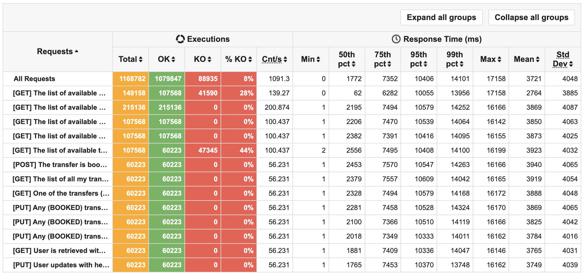

Requests:

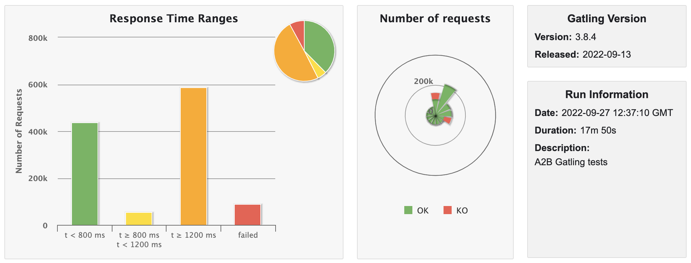

Requests per second:

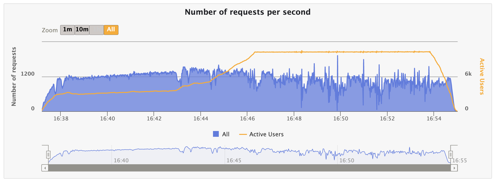

Responses per second:

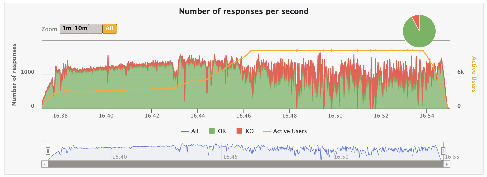

Response time for first minute:

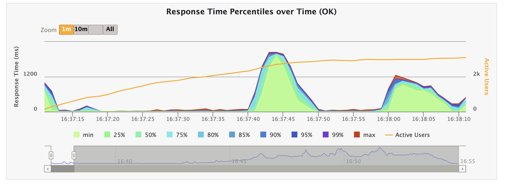

Response time for all time:

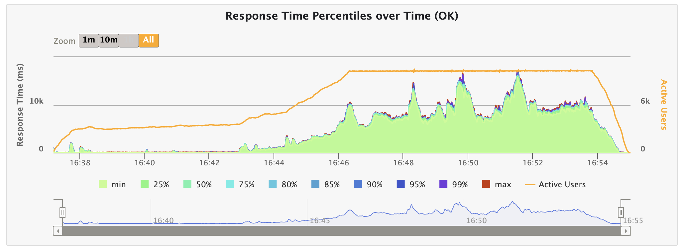

Docker image investigation:

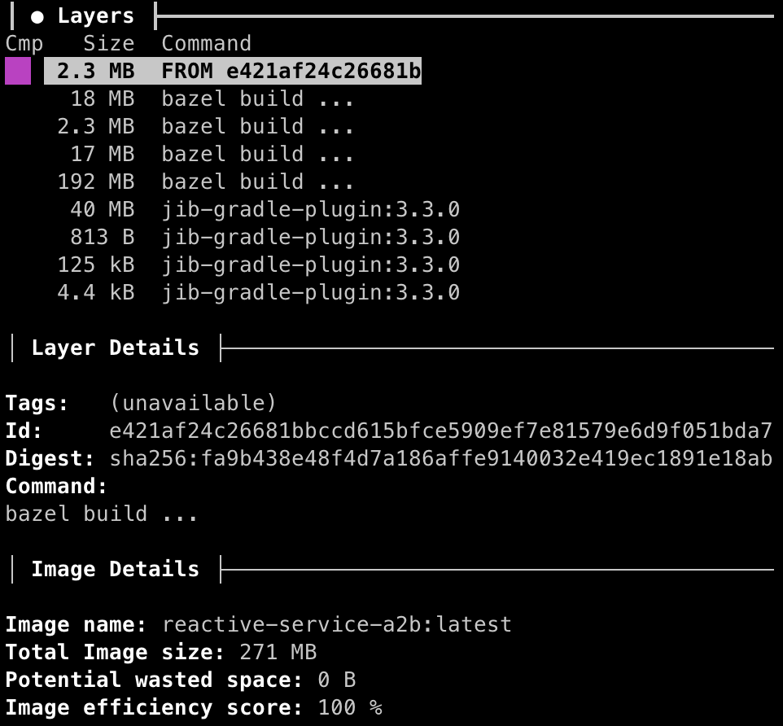

You could download the [Jar Performance Tests Results](./static/reactive/reactive-jar.zip) and [In Docker Performance Tests Results](./static/reactive/reactive-in-docker.zip) and check it on your own.

Let's gather all the information:

|TYPE         |BUILD TIME (s)|ARTIFACT SIZE (MB)|BOOT UP (s)|ACTIVE USERS|RPS    |RESPONSE TIME (95th pct) (ms)|SATURATION POINT|JVM HEAP (MB)|JVM NON-HEAP (MB)|JVM CPU (%)|THREADS (MAX)|POSTGRES CPU (%)|
|:------------|:-------------|:-----------------|:----------|:-----------|:------|:----------------------------|:---------------|:------------|:----------------|:----------|:------------|:---------------|
|JAR          |3,1           |40,6              |2,55       |10326       |1091,3 |10406                        |4391            |1730         |93               |8          |31           |90              |
|JAR IN DOCKER|39            |271               |3,95       |10258       |631.599|18955                        |2250            |790          |93               |29         |31           |37              |

As you can see, in most cases basic approach using jar launching seems pretty good and has the best saturation point.
Move on.

------------------------------------------------------------------------------------------------------------------------

<h6>CHAPTER 3: I GUESS YOU GUYS AREN’T READY FOR THAT YET. BUT YOUR KIDS ARE GONNA LOVE NATIVE.</h6>

Now it's a time to compare previous solution with native one.

### STRONGLY RECOMMEND NOT TO USE SPRING NATIVE IN PRODUCTION AT THE MOMENT. IT COULD LEAD TO UNPREDICTABLE LOSSES.

|JDK|GC|Gradle|Spring Boot|Spring AOT|
|:--|:-|:-----|:----------|:---------|
|17 |G1|7.5.1 |2.7.4      |0.12.1    |

### Gradle Build Script

``` groovy

import org.springframework.aot.gradle.dsl.AotMode

plugins {
    id 'org.springframework.boot' version '2.7.4'
    id 'io.spring.dependency-management' version '1.0.14.RELEASE'
    id 'java'
    id 'org.springframework.experimental.aot' version '0.12.1'
}

group = 'by.vk'
version = '0.0.1-SNAPSHOT'
sourceCompatibility = '17'

repositories {
    maven { url 'https://repo.spring.io/release' }
    mavenCentral()
}

dependencies {
    //region spring
    implementation("org.springframework.boot:spring-boot-starter-data-r2dbc")
    implementation("org.springframework.boot:spring-boot-starter-webflux")
    implementation("org.springframework.boot:spring-boot-starter-actuator") {
        exclude group: 'io.micrometer', module: 'micrometer-core'
    }
    //endregion
    //region logback
    implementation("ch.qos.logback.contrib:logback-jackson:0.1.5")
    implementation("ch.qos.logback.contrib:logback-json-classic:0.1.5")
    //endregion
    //region lombok
    annotationProcessor("org.projectlombok:lombok")
    implementation("org.projectlombok:lombok")
    //endregion
    //region postgres
    implementation("io.r2dbc:r2dbc-postgresql:0.8.13.RELEASE")
    //endregion
}


bootBuildImage {
    buildpacks = ["gcr.io/paketo-buildpacks/java-native-image:7.32.1"]
    builder = "paketobuildpacks/builder:tiny"
    environment = [
            "BP_NATIVE_IMAGE": "true"
    ]
}

springAot {
    mode = AotMode.NATIVE
    debugVerify = false
    removeXmlSupport = true
    removeSpelSupport = true
    removeYamlSupport = false
    removeJmxSupport = true
    verify = true
}

```

And application.yml:

``` yaml

server:
  compression:
    enabled: true

spring:
  main:
    banner-mode: off
    web-application-type: reactive
  cache:
    type: none
  webflux:
    base-path: "api/v1/"
  r2dbc:
    url: "r2dbc:postgresql://localhost:5433/a2b" #for in docker solution replace 'localhost' with 'postgres-a2b'
    username: "postgres"
    password: "postgres"
    properties:
      schema: "a2b"

management:
  health:
    livenessstate:
      enabled: true
    readinessstate:
      enabled: true
  endpoint:
    health:
      enabled: true
      probes:
        enabled: true
      show-components: never
      show-details: never
      group:
        readiness:
          include: readinessState, db
    metrics.enabled: true
    prometheus.enabled: true
  endpoints.web.exposure.include: "*"
  metrics.export.prometheus.enabled: true

logging.level:
  ROOT: info
  by.vk.springbootreactive: info
  org.springframework: info

```

Let's build both solutions, and check its performance.

Commands to build:
> sdk use java 22.2.r17-grl

> ./gradlew clean nativeCompile --parallel

> ./docker/docker-compose up

> ./build/native/nativeCompile/spring-boot-reactive-native

Than you can check the stats of you process. Firstly, we are going to find the pid:

> ps aux | grep :8080 (or you can find by name spring-boot-reactive-native)

Then check it:

> top -pid ${PID}

* NATIVE BUILD TOOLS

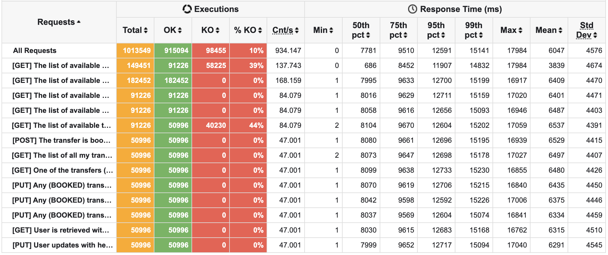


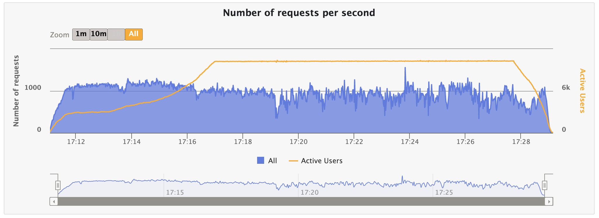

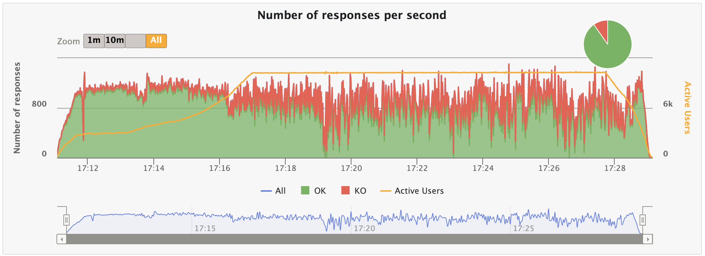

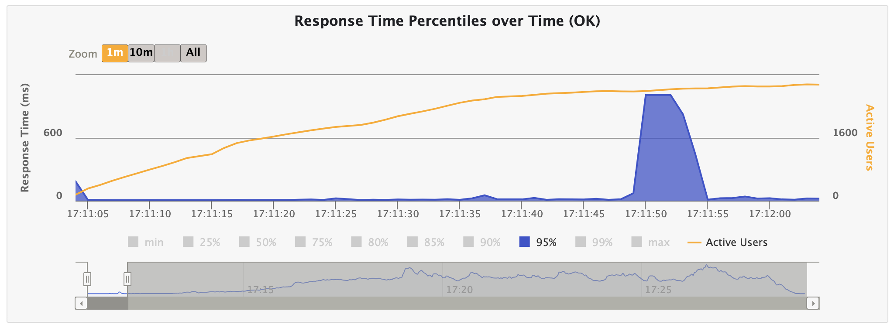

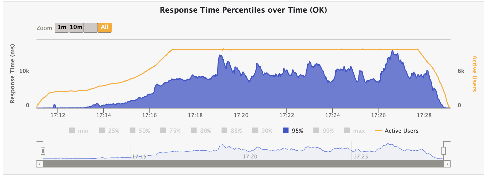

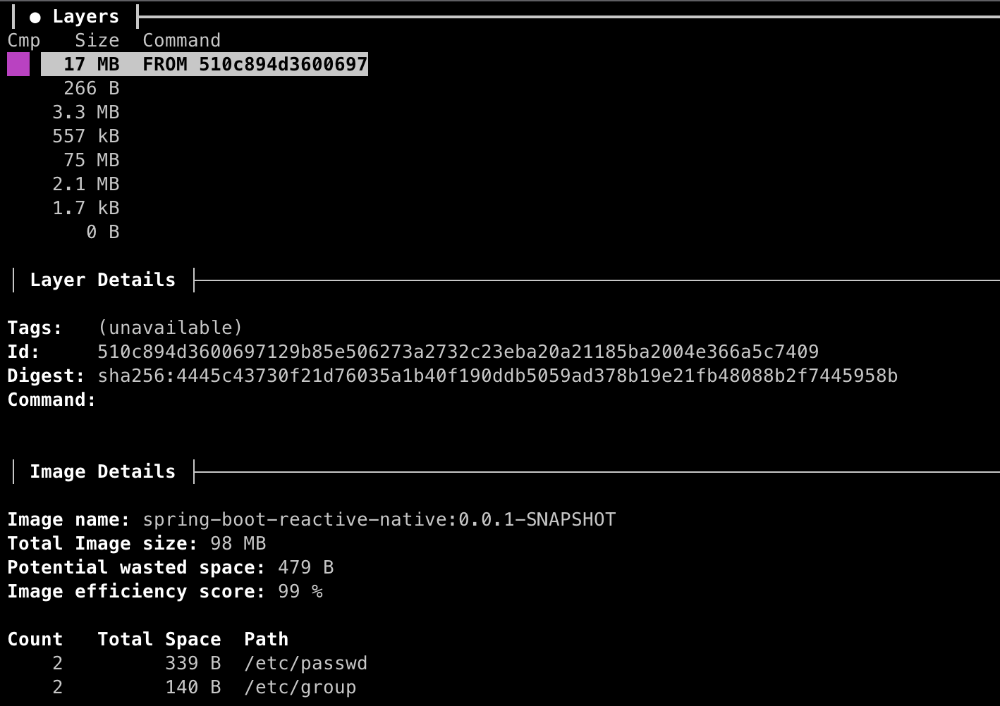

You could download the [Native Build Tools Performance Tests Results](./static/native/native.zip), [Build Pack Performance Tests Results](./static/native/native-in-docker.zip) and check it on your own.
JFYI: The native solution uses Serial GC.

Let's sum it:

|TYPE              |BUILD TIME (s)|ARTIFACT SIZE (MB)|BOOT UP (s)|ACTIVE USERS|RPS    |RESPONSE TIME (95th pct) (ms)|SATURATION POINT|RAM (MB)| CPU (%)|THREADS (MAX)|POSTGRES CPU (%)|
|:-----------------|:-------------|:-----------------|:----------|:-----------|:------|:----------------------------|:---------------|:-------|:-------|:------------|:---------------|
|BUILD PACK        |1243          |114               |0.109      |?           |?      |?                            |?               |?       |?       |?            |?               |
|NATIVE BUILD TOOLS|187           |71,7              |0,1        |10224       |1013549|12591                        |3038            |634     |32      |23           |70              |

------------------------------------------------------------------------------------------------------------------------

<h6>CHAPTER 4: ROADS? WHERE WE’RE GOING, WE DON’T NEED ROADS.</h6>

So what do we have?
Let's compare all the results including the WEB and WEB as Native.

|APPLICATION TYPE|BUILD TYPE        |BUILD TIME (s)|ARTIFACT SIZE (MB)|BOOT UP (s)|ACTIVE USERS|TOTAL REQUESTS|OK     |KO(%)|RPS    |RESPONSE TIME (95th pct) (ms)|SATURATION POINT|RAM (MB)|CPU (%) |THREADS (MAX)|POSTGRES CPU (%)|
|:---------------|:-----------------|:-------------|:-----------------|:----------|:-----------|:-------------|:------|:----|:------|:----------------------------|:---------------|:-------|:-------|:------------|:---------------|
|WEB             |BUILD PACK        |751           |144,79            |1,585      |10201       |453012        |339759 |25   |374.566|47831                        |584             |310     |12,5    |64           |99              |
|WEB             |NATIVE BUILD TOOLS|210           |116,20            |0,310      |8759        |480763        |342782 |29   |414.785|32175                        |1829            |263     |8       |52           |99              |
|WEB             |UNDERTOW          |5             |49,70             |3,59       |10311       |523756        |396071 |24   |381.127|50977                        |1611            |658     |11      |33           |99              |
|WEB             |UNDERTOW IN DOCKER|46            |280               |5,20       |10264       |430673        |289692 |33   |448.682|29998                        |916             |840     |15      |32           |99              |
|REACTIVE        |BUILD PACK        |1243          |129               |?          |?           |              |       |     |?      |?                            |?               |?       |?       |?            |?               |
|REACTIVE        |NATIVE BUILD TOOLS|187           |71,7              |0,107      |10224       |1013549       |915094 |10   |934.147|12591                        |3038            |634     |32      |23           |70              |
|REACTIVE        |JAR               |3,1           |40,6              |2,55       |10326       |1168782       |1079847|8    |1091,3 |10406                        |4391            |1823    |8       |31           |70              |
|REACTIVE        |JAR IN DOCKER     |39            |271               |3,95       |10258       |699180        |581761 |17   |631.599|18955                        |2250            |883     |29      |31           |70              |

------------------------------------------------------------------------------------------------------------------------

<h6>CHAPTER 7: NOBODY CALLS ME CHICKEN.</h6>

------------------------------------------------------------------------------------------------------------------------

<h6>BONUS: GREAT VADZIM!</h6>

This article is the second in my performance journey.

Next, I will bring you details regarding the [Quarkus](https://quarkus.io/), [Micronaut](https://micronaut.io/), [Vert.x](https://vertx.io/), [Helidon](https://helidon.io/), and [Ktor](https://ktor.io/).

So, will be in touch.

HAVE A NICE DAY.

------------------------------------------------------------------------------------------------------------------------

[BACK TO THE MAIN PAGE](../README.md)
