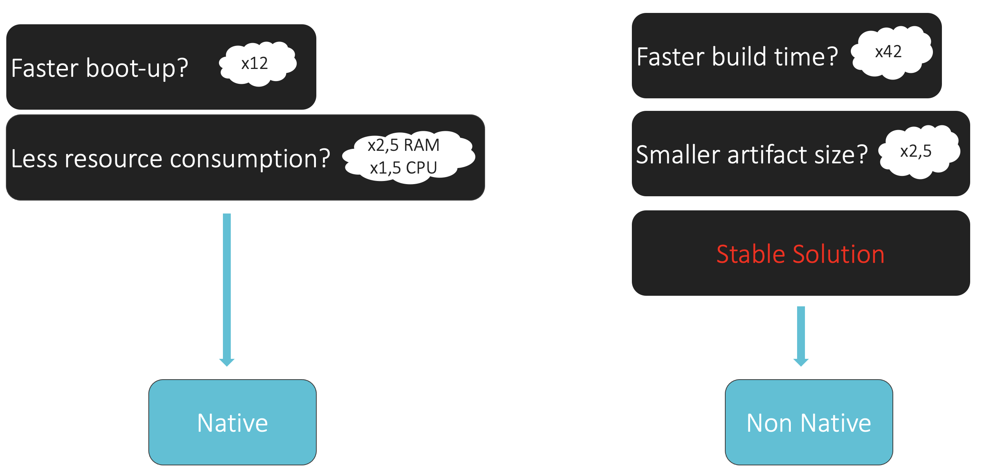

------------------------------------------------------------------------------------------------------------------------


<h6>CHAPTER 1: YOU CAN'T BE DOING THIS, VADZIM. YOU CAN'T KEEP TRYING TO TUNE PERFORMANCE ALL THE TIME.</h6>

Hello, world,

Today I would like to compare the performance of [Spring Boot Web](https://spring.io/projects/spring-boot) and [Spring Boot Web Native](https://docs.spring.io/spring-native/docs/current/reference/htmlsingle/).

I read tons of articles regarding them and found some contradictory results. So, I decided to check it on my own.

I hope you, my reader, are familiar with Spring Boot but I will provide you a quote from official documentation on what is it:
> Spring Boot makes it easy to create stand-alone, production-grade Spring based Applications that you can "just run".
We take an opinionated view of the Spring platform and third-party libraries so you can get started with minimum fuss. Most Spring Boot applications need minimal Spring configuration.
If you’re looking for information about a specific version, or instructions about how to upgrade from an earlier release, check out the project release notes section on our wiki.
Features: Create stand-alone Spring applications; Embed Tomcat, Jetty or Undertow directly (no need to deploy WAR files);
Provide opinionated 'starter' dependencies to simplify your build configuration; Automatically configure Spring and 3rd party libraries whenever possible;
Provide production-ready features such as metrics, health checks, and externalized configuration; Absolutely no code generation and no requirement for XML configuration.

Now, let's check what is Spring Native:
> Spring Native provides support for compiling Spring applications to native executables using the GraalVM native-image compiler.
Compared to the Java Virtual Machine, native images can enable cheaper and more sustainable hosting for many types of workloads. These include microservices, function workloads, well suited to containers, and Kubernetes
Using native image provides key advantages, such as instant startup, instant peak performance, and reduced memory consumption.
There are also some drawbacks and trade-offs that the GraalVM native project expect to improve on over time. Building a native image is a heavy process that is slower than a regular application. A native image has fewer runtime optimizations after warmup. Finally, it is less mature than the JVM with some different behaviors.
The key differences between a regular JVM and this native image platform are:
A static analysis of your application from the main entry point is performed at build time; The unused parts are removed at build time;
Configuration is required for reflection, resources, and dynamic proxies; Classpath is fixed at build time;
No class lazy loading: everything shipped in the executables will be loaded in memory on startup; Some code will run at build time;
There are some limitations around some aspects of Java applications that are not fully supported;
The goal of this project is to incubate the support for Spring Native, an alternative to Spring JVM, and provide a native deployment option designed to be packaged in lightweight containers. In practice, the target is to support your Spring applications, almost unmodified, on this new platform.

I will not dive deeper into AOT and [GraalVM](https://www.graalvm.org/). This is out of the scope of this article.

So, what I am going to check? I would like to check the performance of applications using [Tomcat](https://tomcat.apache.org/), [Jetty](https://www.eclipse.org/jetty/), [Undertow](https://undertow.io/), [JIB](https://github.com/GoogleContainerTools/jib)-built image, and Native Application using both [native build tools](https://docs.spring.io/spring-native/docs/current/reference/htmlsingle/#getting-started-native-build-tools) and [build packs](https://docs.spring.io/spring-native/docs/current/reference/htmlsingle/#getting-started-buildpacks).

Let's move forward.

------------------------------------------------------------------------------------------------------------------------

<h6>CHAPTER 2: MAMA SAYS STUPID IS AS STUPID DOES.</h6>

I've created an application that handles the transportation service business.

Let's assume that the average user has the biggest interest to book the transfer from 8:00 till 00:00.
As a result, we will have 16 per day and 112 hours of load per week.

Furthermore, I would like to share with you some presents:
* I disabled all application levels caches to get clear performance metrics of the server as it is;
* The database and application are running in the same network to avoid net lags and penalties;
* The fetching strategy is `EAGER`. First, to do a higher load and non-optimized queries to the database. Second, not to spend time to set up entity graphs.
* The average time to boot up the service will not depend on the database structure due to the fact that I am not using any database migration tools such as [Flyway](https://flywaydb.org/) or [Liquibase](https://www.liquibase.org/);
* All database structures had been already prepared and filled with faked data;
* As a load testing tool I chose [Gatling](https://gatling.io/);
* The versions of all languages, frameworks, libraries, and databases are the latest LTS at the moment of testing.

So, let's create the database definition for my application. The script is pretty easy to read and understand if you are familiar with SQL.


```sql
-- SCHEMA DEFINITION
CREATE SCHEMA IF NOT EXISTS A2B;
SET
SEARCH_PATH TO A2B;

-- USERS TABLE DEFINITION
CREATE TABLE users
(
    id         bigserial   NOT NULL,
    first_name varchar(50) NOT NULL,
    last_name  varchar(50) NOT NULL,
    email      varchar(50) NOT NULL,
    phone      varchar(50) NOT NULL,

    CONSTRAINT "pk_domain_user.user" PRIMARY KEY (id)
);

CREATE UNIQUE INDEX "domain_user.email_index" ON users (email);
CREATE UNIQUE INDEX "domain_user.phone_index" ON users (email);

-- COUNTRIES TABLE DEFINITION
CREATE TABLE countries
(
    id   bigserial   NOT NULL,
    name varchar(50) NOT NULL,
    code varchar(10) NOT NULL,

    CONSTRAINT "pk_domain_country.country" PRIMARY KEY (id)
);

-- CITIES TABLE DEFINITION
CREATE TABLE cities
(
    id         bigserial    NOT NULL,
    country_id bigint       NOT NULL,
    name       varchar(100) NOT NULL,
    code       varchar(10)  NOT NULL,

    CONSTRAINT "pk_domain_city.city" PRIMARY KEY (id),
    FOREIGN KEY (country_id) REFERENCES countries (id) ON DELETE CASCADE
);

-- LOCATIONS TABLE DEFINITION
CREATE TABLE locations
(
    id       bigserial NOT NULL,
    city_id  bigint    NOT NULL,
    location jsonb     NOT NULL,

    CONSTRAINT "pk_domain_location.location" PRIMARY KEY (id),
    FOREIGN KEY (city_id) REFERENCES cities (id) ON DELETE CASCADE
);

-- TRANSFERS TABLE DEFINITION
CREATE TABLE transfers
(
    id          bigserial NOT NULL,
    origin      bigint    NOT NULL,
    destination bigint    NOT NULL,
    capacity    smallint  NOT NULL,
    date        date      NOT NULL,
    duration    tsrange   NOT NULL,
    price       money     NOT NULL,
    description text      NOT NULL,

    CONSTRAINT "pk_domain_transfer.transfer" PRIMARY KEY (id),
    FOREIGN KEY (origin) REFERENCES locations (id) ON DELETE CASCADE,
    FOREIGN KEY (destination) REFERENCES locations (id) ON DELETE CASCADE
);

-- USERS_TRANSFERS TABLE DEFINITION
CREATE TABLE users_transfers
(
    user_id     bigint      NOT NULL,
    transfer_id bigint      NOT NULL,
    state       varchar(10) NOT NULL,
    description text        NOT NULL,

    CONSTRAINT "pk_domain_users_transfers.users_transfers" PRIMARY KEY (user_id, transfer_id),
    FOREIGN KEY (user_id) REFERENCES users (id) ON DELETE CASCADE,
    FOREIGN KEY (transfer_id) REFERENCES transfers (id) ON DELETE CASCADE
);
```

To kick off the creation I've prepared the docker-compose file:

```docker
version: '3.8'
services:

  postgres:
    image: postgres:14.2-alpine
    container_name: postgres
    hostname: postgres
    restart: on-failure
    environment:
      - POSTGRES_USER=user
      - POSTGRES_PASSWORD=password
      - POSTGRES_DB=a2b
    ports:
      - "5433:5432"
    volumes:
      - ./database_definition.sql:/docker-entrypoint-initdb.d/database_definition.sql

  pgadmin:
    image: dpage/pgadmin4:6.9
    container_name: pgadmin4
    restart: on-failure
    environment:
      PGADMIN_DEFAULT_EMAIL: user@user.com
      PGADMIN_DEFAULT_PASSWORD: "password"
    ports:
      - "5050:80"
    depends_on:
      - postgres

  prometheus:
    image: prom/prometheus:latest
    container_name: prometheus
    ports:
      - "9090:9090"
    volumes:
      - "./prometheus.yml:/etc/prometheus/prometheus.yml"
    command:
      - "--config.file=/etc/prometheus/prometheus.yml"

  grafana:
    image: grafana/grafana:latest
    container_name: grafana
    ports:
      - "3000:3000"

```

To connect via pgadmin follow [pgadmin](localhost:5050) enter "user@user.com" and "password".
Create server and attach to host `docker inspect $(docker ps -aqf "name=postgres") | grep IPAddress`, port "5433", db "postgres" with "user" and "password" credentials.

Now, let's imagine the number of entities in use. I decided to launch the application for one country with six cities. I love my country, it's about Belarus.
So, in every city, we will have 20 points to be able to arrive or depart. I assume that every point has about 100 transfers.
The target audience is 200_000 users. And every one of them has at least 2 transfers.

|       UNIT      | AMOUNT |
|:----------------|:-------|
| Countries       | 1      |
| Cities          | 6      |
| Locations       | 120    |
| Transfers       | 12000  |
| Users           | 200000 |
| Users_Transfers | 500000 |

All this files you could find [there in my repository](https://github.com/fragaLY/performance-researches/tree/master/env/database).

For a generation of the dataset, I've created the other module [datagen](https://github.com/fragaLY/performance-researches/tree/master/datagen).
I will not dive deeper into data generation process. You could easily check out how it works in sources. After that, I got DB size, and DB dump, and created a separate docker image with the predefined dataset.
This docker image is located in every tested module directory. I've already described how to create a custom db image in my [previous post](../postgres-custom-image/POSTGRES-CUSTOM-IMAGE.md).

The DB metrics:

* Database size: 153 MB
* Database dump size: 130.8 MB
* Docker image with predefined data: 160.01 MB

OK, now we have the dataset. The next step is the creation of test scenarios and preparing everything for running a performance test.

------------------------------------------------------------------------------------------------------------------------
<h6>CHAPTER 3: RUN, GATLING, RUN!</h6>

Now is the time to provide some use cases and create test scenarios.

### USE CASES

| #    | Scenario step          | Assumed operation           |
| :--: | :--------------------- | :-------------------------- |
| 1    | As a user I would like to choose the country. | [GET] The list of available countries is presented. |
| 2    | As a user I would like to choose the city. | [GET] The list of available cities is presented. |
| 3    | As a user I would like to choose the origin. | [GET] The list of available origins is presented. |
| 4    | As a user I would like to choose the destination. | [GET] The list of available destinations is presented.  |
| 5    | As a user I would like to choose the date of transfer. | [GET] [NO LOAD] The future dates for the current month are presented. |
| 6    | As a user I would like to see all available transfers from 'origin', to 'destination' for selected this date. | [GET] The list of available transfers by selected origin, destination, and date is presented. |
| 7    | As a user I would like to book a transfer. | [POST] The transfer is booked in the system. |
| 8    | As a user I would like to see all my transfers. | [GET] The list of all my transfers (COMPLETED, CANCELED, BOOKED) is presented. |
| 9    | As a user I would like to view any owned transfer. | [GET] One of the transfers (COMPLETED, CANCELED, BOOKED) is retrieved. |
| 10   | As a user I would like to edit any owned transfer in the future. | [PUT] Any (BOOKED) transfer description is updated. |
| 11   | As a user I would like to cancel any owned transfer in the future. | [PUT] Any (BOOKED) transfer is canceled (CANCELED).  |
| 12   | As a user I would like to complete any owned transfer in the past. | [PUT] Any (BOOKED) transfer is completed (COMPLETED).  |
| 13   | As a user I would like to see my profile. | [GET] User is retrieved with her/his transfers data. |
| 14   | As a user I would like to update my profile. | [PUT] User updates with her/his own data. |
| 15   | Repeat (1) - (9) 20 minutes for each user. | |

OK, nice job fellows. Seems like now we need to bring these scenarios to life. And there is a [Gatling](https://gatling.io/).

The steps and settings for Gatling I've already provided in my previous post. [Check it up!](../gatling-java-gradle-setup/GATLING-JAVA-GRADLE-SETUP.md)

The machine I will do all the actions is the next:

> Model Name: MacBook Pro

> Model Identifier: MacBookPro16,2

> Processor Name: Quad-Core Intel Core i7

> Processor Speed: 2,3 GHz

> Number of Processors: 1

> Total Number of Cores: 4

> L2 Cache (per Core): 512 KB

> L3 Cache: 8 MB

> Hyper-Threading Technology: Enabled

> Memory:	32 GB

------------------------------------------------------------------------------------------------------------------------
<h6>CHAPTER 4: MY MAMA ALWAYS SAID LIFE WAS LIKE A BOX OF BEAN DEFINITIONS. YOU NEVER KNOW WHAT YOU'RE GONNA GET.</h6>

Good job,

Now we need to create the application that we are going to test.

The initial implementation will be on Spring Boot Web.
The sources you could find [there](https://github.com/fragaLY/performance-researches/tree/master/spring-boot-web).

The languages, frameworks, and tools I used.

|JDK|GC|Gradle|Spring Boot|
|:--|:-|:-----|:----------|
|17 |G1|7.5   |2.7.1      |

I will highlight some of the configurations here.

### Gradle Build Script

```groovy
plugins {
    id("java")
    id("org.springframework.boot") version "2.7.1"
    id("io.spring.dependency-management") version "1.0.12.RELEASE"
    id("com.google.cloud.tools.jib") version "3.2.1"
}

group = 'by.vk'
version = '0.0.1-SNAPSHOT'
sourceCompatibility = '17'

repositories {
    mavenCentral()
}

dependencies {
    //region spring
    implementation("com.vladmihalcea:hibernate-types-55:2.16.3")
    implementation("org.springframework.boot:spring-boot-starter-data-jpa")
    implementation("org.springframework.boot:spring-boot-starter-web") {
        exclude group: 'org.springframework.boot', module: 'spring-boot-starter-tomcat'
    }
    implementation("org.springframework.boot:spring-boot-starter-undertow")
    implementation("org.springframework.boot:spring-boot-starter-validation")
    implementation("org.springframework.boot:spring-boot-starter-actuator")
    implementation("org.springframework:spring-context-indexer")
    annotationProcessor("org.springframework.boot:spring-boot-configuration-processor")
    implementation("org.springdoc:springdoc-openapi-ui:1.6.9")
    //endregion
    //region logback
    implementation("ch.qos.logback.contrib:logback-jackson:0.1.5")
    implementation("ch.qos.logback.contrib:logback-json-classic:0.1.5")
    //endregion
    //region lombok
    annotationProcessor("org.projectlombok:lombok")
    implementation("org.projectlombok:lombok")
    //endregion
    //region postgres
    runtimeOnly("org.postgresql:postgresql")
    //endregion
}

jib {
    to {
        image = 'service-a2b:latest'
    }
    from {
        image = "gcr.io/distroless/java17"
    }
    container {
        jvmFlags = ['-noverify', '-XX:+UseContainerSupport', '-XX:MaxRAMPercentage=75.0', '-XX:InitialRAMPercentage=50.0', '-XX:+OptimizeStringConcat', '-XX:+UseStringDeduplication', '-XX:+ExitOnOutOfMemoryError', '-XX:+AlwaysActAsServerClassMachine', '-Xmx512m', '-Xms128m', '-XX:MaxMetaspaceSize=128m', '-XX:MaxDirectMemorySize=256m', '-XX:+HeapDumpOnOutOfMemoryError', '-XX:HeapDumpPath=/opt/tmp/heapdump.bin']
        ports = ['8080']
        labels.set([maintainer: 'Vadzim Kavalkou <vadzim.kavalkou@gmail.com>', appname: 'a2b-service', version: '0.0.1-SNAPSHOT'])
        creationTime = 'USE_CURRENT_TIMESTAMP'
    }
}
```

And application.yml, for sure.

```yaml
server:
  compression:
    enabled: true
  undertow:
    threads:
      io: 4 # default: equals to cores count
      worker: 8 # default: 8

spring:
  main:
    banner-mode: off
  cache:
    type: none
  datasource:
    driverClassName: org.postgresql.Driver
    url: "jdbc:postgresql://postgres-a2b:5432/a2b?currentSchema=a2b" #for local solution replace 'postgres-a2b' with localhost and port '5432' to '5433'
    username: "postgres"
    password: "postgres"
    hikari:
      minimumIdle: 4 # default: same as maximumPoolSize
      maximumPoolSize: 8 # cores * 2; default is 10
      connection-timeout: 35000 #default 30000
      pool-name: "hikari-pool"
      idle-timeout: 10000 # default: 600000 (10 minutes)
      max-lifetime: 35000 # default: 1800000 (30 minutes)
      keepaliveTime: 30000 # default: 0 (disabled)
  jpa:
    open-in-view: false
    database-platform: org.hibernate.dialect.PostgreSQL95Dialect
    hibernate:
      ddl-auto: none
    properties:
      hibernate:
        cache:
          use_query_cache: false
          use_second_level_cache: false
          use_structured_entries: false
          use_minimal_puts: false
        default_schema: "a2b"
        types:
          print:
            banner: false

management:
  health:
    livenessstate:
      enabled: true
    readinessstate:
      enabled: true
  endpoint:
    health:
      enabled: true
      probes:
        enabled: true
      show-components: never
      show-details: never
      group:
        readiness:
          include: readinessState, db
    metrics.enabled: true
    prometheus.enabled: true
  endpoints.web.exposure.include: "*"
  metrics.export.prometheus.enabled: true

logging.level:
  ROOT: info
  by.vk.springbootweb: info
  org.springframework: info
```

As I already mentioned, I decided to check all possible embedded servers.
So, I've build the *.jar file and launched it several times for different servers.
After that, I've created the image using [JIB](https://github.com/GoogleContainerTools/jib) to be able to create images without Docker Engine and took the [distroless](https://github.com/GoogleContainerTools/distroless) as a base image due to the next benefits of it:
>"Distroless" images contain only your application and its runtime dependencies. They do not contain package managers, shells or any other programs you would expect to find in a standard Linux distribution.

Let's check the results.

* TOMCAT

``` yaml
server:
  compression:
    enabled: true
  tomcat:
    accept-count: 100 # default: 100
    threads:
      max: 200 # default: 200
      min-spare: 10 # default: 10

```


* JETTY

``` yaml
server:
 compression:
   enabled: true
 jetty:
   threads:
     max: 200 # default: 200
     min: 8 # default: 8

```


* UNDERTOW

``` yaml
server:
 compression:
   enabled: true
 undertow:
   threads:
     io: 4 # default: equals to cores count
     worker: 8 # default: 8

```

Global information:


Requests:


Requests per second:


Responses per second:


Response time for first minute:


Response time for all time:


Docker image investigation:


You could download the [Performance Tests Results](./static/web/web.zip) and check it on your own.

Let's gather all the information:

|TYPE    |BUILD TIME (s)|ARTIFACT SIZE (MB)|BOOT UP (s)|ACTIVE USERS|RPS    |RESPONSE TIME (95th pct) (ms)|SATURATION POINT|JVM HEAP (MB)|JVM NON-HEAP (MB)|JVM CPU (%)|THREADS (MAX)|POSTGRES CPU (%)|
|:-------|:-------------|:-----------------|:----------|:-----------|:------|:----------------------------|:---------------|:------------|:----------------|:----------|:------------|:---------------|
|TOMCAT  |N/A           |N/A               |3,94       |8168        |418,715|:white_check_mark: 29289     |1568            |:white_check_mark: 365|94      |12         |226          |99              |
|JETTY   |N/A           |N/A               |3,83       |10201       |421.816|54207                        |1592            |1137         |94               |14         |224          |99              |
|UNDERTOW|:white_check_mark: 5|:white_check_mark: 49,70|:white_check_mark: 3,59|:white_check_mark: 10311|381.127|50977|:white_check_mark: 1611|658|94      |:white_check_mark: 11|:white_check_mark: 33|99|
|UNDERTOW IN DOCKER|46  |280               |5,20       |10264       |:white_check_mark: 448.682|29998     |916             |756          |94               |15         |32           |99              |

As you can see, in most cases undertow seems pretty good and has the best saturation point.
Nevertheless, the tomcat provides us with a better response time and JVM heap metrics.

The metrics of the docker container we will compare a bit soon with the other solution.
Move on.

------------------------------------------------------------------------------------------------------------------------

<h6>CHAPTER 5: MY MAMA ALWAYS SAID YOU'VE GOT TO PUT THE PAST BEHIND YOU BEFORE YOU CAN MOVE ON.</h6>

Hmm, seems the most interesting part is here. Not so stable without a major version of Spring Native.
It was very interesting for me to understand it better and compare it with the previous solution.

Soon, I will provide you with some high-level settings and configurations.
First of all, I would to say you that Spring Native has a lot of limitations starting from choosing the server in use and ending with working with different types of Postgres types such as jsonb and tsrange.

Some of the cases I tried to investigate in the Spring Native repository, some of them I solved, and in other cases I found workarounds. As [this one](https://github.com/spring-projects-experimental/spring-native/issues/1668).

### STRONGLY RECOMMEND NOT TO USE SPRING NATIVE IN PRODUCTION AT THE MOMENT. IT COULD LEAD TO UNPREDICTABLE LOSSES.

|JDK|GC|Gradle|Spring Boot|Spring AOT|
|:--|:-|:-----|:----------|:---------|
|17 |G1|7.5   |2.7.1      |0.12.1    |

### Gradle Build Script

``` groovy
import org.springframework.aot.gradle.dsl.AotMode

plugins {
    id("java")
    id("org.springframework.boot") version "2.7.1"
    id("io.spring.dependency-management") version "1.0.12.RELEASE"
    id("org.springframework.experimental.aot") version "0.12.1"
    id("org.hibernate.orm")
}

group = 'by.vk'
version = '0.0.1-SNAPSHOT'

repositories {
    maven { url 'https://repo.spring.io/release' }
    mavenCentral()
}

dependencies {
    //region spring
    implementation("org.springframework.boot:spring-boot-starter-data-jpa")
    implementation("org.springframework.boot:spring-boot-starter-web")
    implementation("org.springframework.boot:spring-boot-starter-validation")
    implementation("org.springframework.boot:spring-boot-starter-actuator") {
        exclude group: 'io.micrometer', module: 'micrometer-core'
    }
    //endregion
    //region logback
    implementation("ch.qos.logback.contrib:logback-jackson:0.1.5")
    implementation("ch.qos.logback.contrib:logback-json-classic:0.1.5")
    //endregion
    //region lombok
    annotationProcessor("org.projectlombok:lombok")
    implementation("org.projectlombok:lombok")
    //endregion
    //region postgres
    runtimeOnly("org.postgresql:postgresql")
    //endregion
}

bootBuildImage {
    buildpacks = ["gcr.io/paketo-buildpacks/java-native-image:7.23.0"]
    builder = "paketobuildpacks/builder:tiny"
    environment = [
            "BP_NATIVE_IMAGE": "true"
    ]
}

springAot {
    mode = AotMode.NATIVE
    debugVerify = false
    removeXmlSupport = true
    removeSpelSupport = true
    removeYamlSupport = false
    removeJmxSupport = true
    verify = true
}

hibernate {
    enhance {
        enableLazyInitialization = false
        enableDirtyTracking = true
        enableAssociationManagement = true
        enableExtendedEnhancement = false
    }
}
```

And application.yml:

``` yaml
server:
  compression:
    enabled: true
  tomcat:
    threads:
      max: 32
      min-spare: 4

spring:
  main:
    banner-mode: off
  cache:
    type: none
  data:
    jpa:
      repositories:
        bootstrap-mode: default
  datasource:
    driverClassName: org.postgresql.Driver
    url: "jdbc:postgresql://postgres-a2b:5432/a2b?currentSchema=a2b" #for local solution replace 'postgres-a2b' with localhost and port '5432' to '5433'
    username: "postgres"
    password: "postgres"
    hikari:
      minimumIdle: 4 # default: same as maximumPoolSize
      maximumPoolSize: 8 # cores * 2; default is 10
      connection-timeout: 35000 #default 30000
      pool-name: "hikari-pool"
      idle-timeout: 10000 # default: 600000 (10 minutes)
      max-lifetime: 35000 # default: 1800000 (30 minutes)
      keepaliveTime: 30000 # default: 0 (disabled)
  jpa:
    open-in-view: false
    database-platform: org.hibernate.dialect.PostgreSQL95Dialect
    hibernate:
      ddl-auto: none
    properties:
      hibernate:
        cache:
          use_query_cache: false
          use_second_level_cache: false
          use_structured_entries: false
          use_minimal_puts: false
        default_schema: "a2b"
        types:
          print:
            banner: false

management:
  health:
    livenessstate:
      enabled: true
    readinessstate:
      enabled: true
  endpoint:
    health:
      enabled: true
      probes:
        enabled: true
      show-components: never
      show-details: never
      group:
        readiness:
          include: readinessState, db
    metrics.enabled: true
    prometheus.enabled: true
  endpoints.web.exposure.include: "*"
  metrics.export.prometheus.enabled: true

logging.level:
  ROOT: info
  by.vk.springbootwebnative: info
  org.springframework: info
```

Let's build both solutions, and check its performance.

* TOMCAT (other servers are not supported)

``` yaml
server:
  compression:
    enabled: true
  tomcat:
    threads:
      max: 32
      min-spare: 4

```


You could download the [Performance Tests Results](./static/native/native.zip) and check it on your own.

Let's sum it:

|TYPE              |BUILD TIME (s)|ARTIFACT SIZE (MB)|BOOT UP (s)|ACTIVE USERS|RPS    |RESPONSE TIME (95th pct) (ms)|SATURATION POINT|RAM (MB)| CPU (%)|THREADS (MAX)|POSTGRES CPU (%)|
|:-----------------|:-------------|:-----------------|:----------|:-----------|:------|:----------------------------|:---------------|:-------|:-------|:------------|:---------------|
|BUILD PACK        |751           |144,79            |:white_check_mark: 0,285|:white_check_mark: 10201|374.566|47831|584             |310     |12,5    |64           |99              |
|NATIVE BUILD TOOLS|:white_check_mark: 210|116,20    |0,310      |8759        |:white_check_mark: 414.785|:white_check_mark: 32175|:white_check_mark: 1829|:white_check_mark: 263|:white_check_mark: 8|:white_check_mark: 52|99              |

Unbelievable build time, I drink two cups of coffee building it. But... look at the boot-up time. It's incredible. Awesome! Nice job Spring Native team!

Checking all the metrics, we could find that the solution with native build tools is pretty better.
Now... the time to compare non-native and native application metrics.

------------------------------------------------------------------------------------------------------------------------

<h6>CHAPTER 6: FROM THAT DAY ON, WE WAS ALWAYS TOGETHER. SPRING AND NATIVE WAS LIKE PEAS AND CARROTS.</h6>

OK, OK, OK. What do we have?

|TYPE              |BUILD TIME (s)|ARTIFACT SIZE (MB)|BOOT UP (s)|ACTIVE USERS|RPS    |RESPONSE TIME (95th pct) (ms)|SATURATION POINT|RAM (MB)| CPU (%)|THREADS (MAX)|POSTGRES CPU (%)|
|:-----------------|:-------------|:-----------------|:----------|:-----------|:------|:----------------------------|:---------------|:-------|:-------|:------------|:---------------|
|BUILD PACK        |751           |144,79            |1,585      |10201       |374.566|47831                        |584             |310     |12,5    |64           |99              |
|NATIVE BUILD TOOLS|210           |116,20            |:white_check_mark: 0,310      |8759        |414.785|32175                        |:white_check_mark: 1829            |:white_check_mark: 263     |:white_check_mark: 8       |52           |99              |
|UNDERTOW          |:white_check_mark: 5             |:white_check_mark: 49,70             |3,59       |:white_check_mark: 10311       |381.127|50977                        |1611            |658     |11      |33           |99              |
|UNDERTOW IN DOCKER|46            |280               |5,20       |10264       |:white_check_mark: 448.682|:white_check_mark: 29998                        |916             |840     |15      |:white_check_mark: 32           |99              |

To be honest, it's hard to compare different approaches with different purposes. Hold on. The purpose is the only one - the profit.
You could choose the approach that fits better for your business. You know your customers better than someone else. Even better in some cases than a customer. LOL.

In case you need a faster boot-up time, you could prefer the native solutions. But as I said before I strongly recommend you not to bring it into production at the moment.
If you decided to bring it in, please consider reviewing your CI/CD due to the fact that the delivery time will increase several times.
If it's not applicable for you and you have to have time to market as less as possible, think about it twice.
Nevertheless, the native build tools build provides not have such a big build time as the build pack and provides us with the best saturation point, RAM usage, and CPU utilization.
And, of cuz, take a look at the boot-up time... 310 ms, Caaaaarl.

In other cases, the solution with Undertow is pretty better and stable. To take the risk or not - is your decision. Chose your destiny.




------------------------------------------------------------------------------------------------------------------------

<h6>CHAPTER 7: MAMA ALWAYS SAID YOU CAN TELL A LOT ABOUT APPLICATIONS BY THEIR PERFORMANCE. WHERE THEY'VE BEEN, WHERE THEY'RE GOING.</h6>

To sum up, honestly, it was a hard and interesting way to take a view on both solutions.
I really enjoy the way Spring is moving on. It is going on to be faster in all meanings.

Thank you, Spring Native team!
Thank you whole the Spring Team!
Long live Pivotal Software!

------------------------------------------------------------------------------------------------------------------------

<h6>BONUS: LIEUTENANT DAN GOT ME INVESTED IN SOME KIND OF SPRING COMPANY.</h6>

This article is the first in my performance journey.

Next, I will bring you details regarding the [Spring Reactive](https://spring.io/reactive) approaches, [Quarkus](https://quarkus.io/), [Micronaut](https://micronaut.io/), [Vert.x](https://vertx.io/), [Helidon](https://helidon.io/), and [Ktor](https://ktor.io/).

I will try to build it as native as well.

So, will be in touch.

HAVE A NICE DAY.

------------------------------------------------------------------------------------------------------------------------

[BACK TO THE MAIN PAGE](../README.md)
